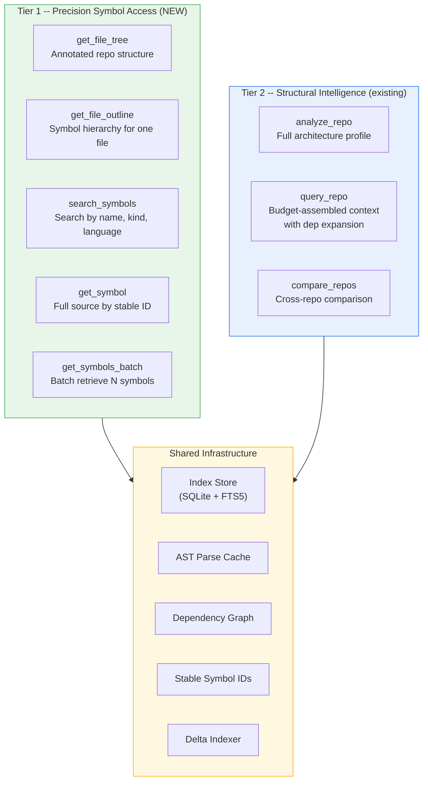
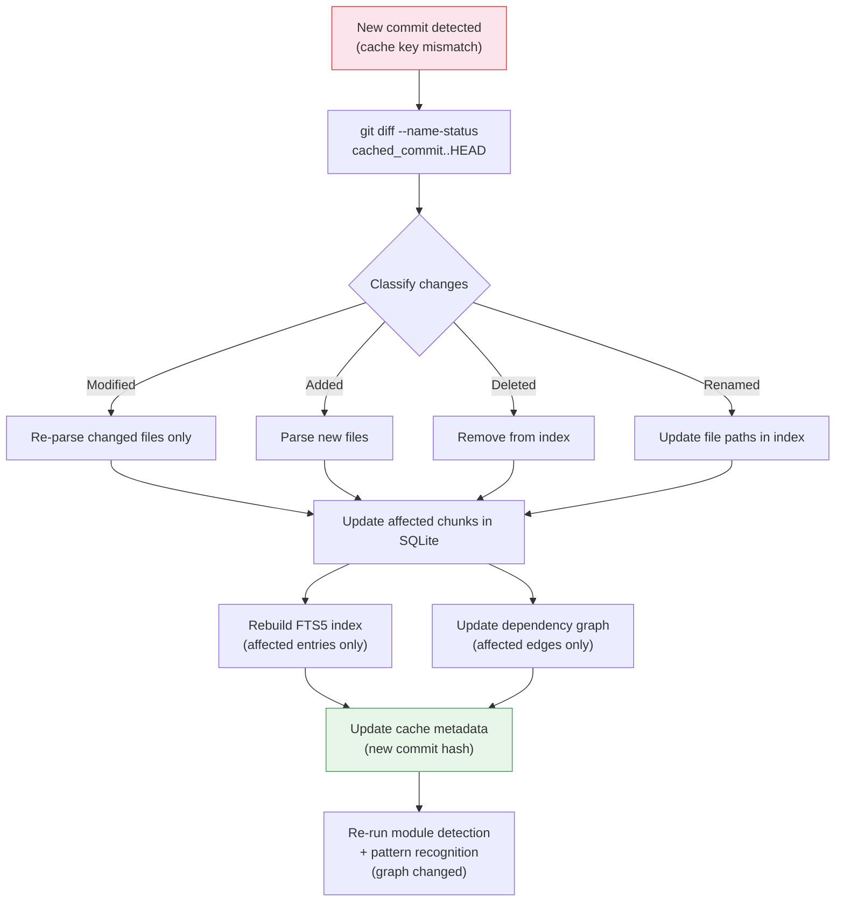
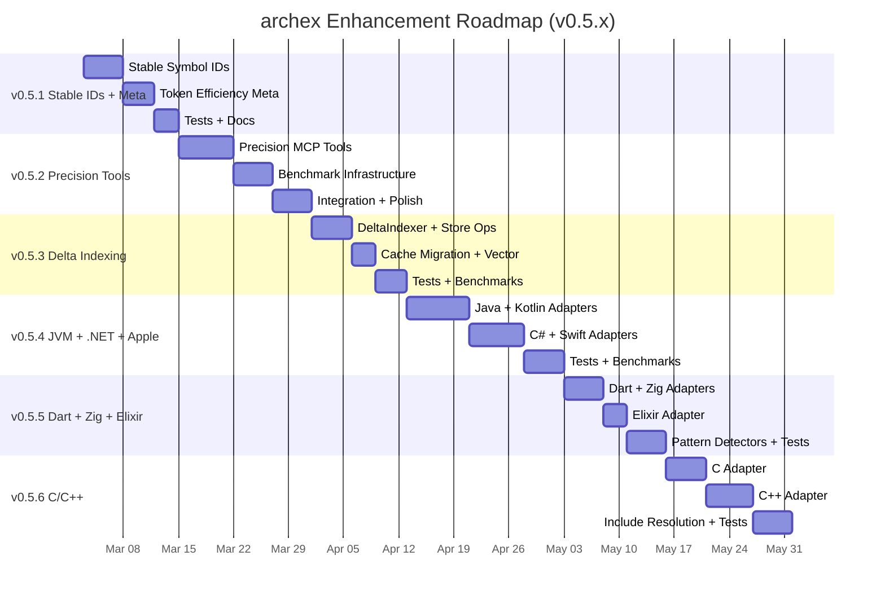
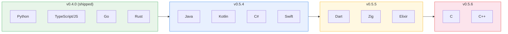

# archex -- Enhancement Development Plan

> v0.5.1 through v0.5.6 Roadmap: Stable identifiers, precision tools, token reporting, benchmarking, delta indexing, and language coverage across every major ecosystem.

---

## 1. Strategic Context

archex v0.4.0 delivers a complete structural retrieval pipeline: AST-aware chunking, dependency graph expansion, module detection, pattern recognition, and token-budgeted context assembly across 4 languages. The library answers "how does X work in this codebase?" in a single call.

This enhancement plan expands archex along six axes:

1. **Stable symbol identifiers** -- Formalized, human-readable, deterministic IDs that persist across re-indexing when the underlying code hasn't changed.
2. **Precision symbol tools** -- Individual MCP tools for surgical symbol lookup, file outlines, and tree navigation. Agents choose the right granularity: single symbol for a quick lookup, full context bundle for understanding a subsystem.
3. **Token efficiency reporting** -- Every tool response includes a `_meta` block quantifying tokens saved vs. raw file access, making efficiency gains visible and measurable.
4. **Benchmarking infrastructure** -- Reproducible benchmarks measuring total agent workflow cost (including tool-call overhead) across real-world repos and tasks.
5. **Delta indexing** -- Incremental re-indexing that detects which files changed between commits and surgically updates only the affected chunks, edges, and FTS entries instead of rebuilding the entire index.
6. **Expanded language support** -- Phased language expansion from 4 to 13 adapters across web, backend, systems, JVM, .NET, Apple, mobile, and BEAM ecosystems.

### Versioning Scheme

All enhancements ship as minor releases within the v0.5.x line:

| Release | Enhancement | Timeline |
|---|---|---|
| **v0.5.1** | Stable IDs + Token Reporting | ~2 weeks |
| **v0.5.2** | Precision Tools + Benchmarking | ~3 weeks |
| **v0.5.3** | Delta Indexing | ~2 weeks |
| **v0.5.4** | Language Expansion: JVM + .NET + Apple | ~3.5 weeks |
| **v0.5.5** | Language Expansion: Mobile + BEAM + Next-Gen Systems | ~2.5 weeks |
| **v0.5.6** | Language Expansion: C/C++ | ~3.5 weeks |

---

## 2. Architecture: Two-Tier Tool Surface



Both tiers share the same index infrastructure. Tier 1 tools provide low-token, surgical access. Tier 2 tools provide high-fidelity, pre-assembled context with structural metadata. The agent selects the appropriate tier based on task needs. The Delta Indexer ensures the shared infrastructure stays current without full re-indexing after every commit.

---

## 3. Enhancement 1: Stable Symbol Identifiers (v0.5.1)

### 3.1 Problem

Current `CodeChunk.id` uses the format `{file_path}:{symbol_name}:{start_line}`. This is functional but fragile -- adding a blank line above a function shifts all IDs below it. Agents and external tools cannot reliably reference symbols across re-indexing.

### 3.2 Stable ID Scheme

```
{file_path}::{qualified_name}#{kind}
```

**Examples:**

```
src/httpx/_pool.py::ConnectionPool#class
src/httpx/_pool.py::ConnectionPool.handle_request#method
src/httpx/_pool.py::MAX_CONNECTIONS#constant
src/utils.py::authenticate#function
src/utils.py::_module#module           <- file-level code chunks
cmd/main.go::ServeHTTP#method
src/lib.rs::impl_Pool::acquire#method  <- Rust impl block method
```

**Stability contract:**
- ID remains identical across re-indexing if `file_path`, `qualified_name`, and `kind` are unchanged.
- Renaming a symbol changes its ID (expected behavior).
- Moving a symbol to a different file changes its ID (expected behavior).
- Adding/removing lines above/below the symbol does NOT change its ID.

**Collision handling:**

In rare cases (e.g., function overloads in TypeScript, multiple `impl` blocks in Rust), the base scheme may produce duplicates. Append a disambiguation suffix:

```
src/handlers.ts::processEvent#function         <- first definition
src/handlers.ts::processEvent#function@2       <- second overload
```

The suffix `@N` is ordinal by source position.

### 3.3 Implementation

| File | Change |
|---|---|
| `models.py` | Add `SymbolId` type alias (`str`), add `symbol_id` field to `CodeChunk`, add `SymbolRef` model with `symbol_id`, `file_path`, `name`, `kind` |
| `index/chunker.py` | Replace `_make_chunk_id()` with `_make_symbol_id()` using `{path}::{qualified_name}#{kind}` scheme. Handle disambiguation for duplicates. |
| `parse/symbols.py` | Ensure `qualified_name` is populated on all `Symbol` objects (currently `name` only for some adapters) |
| `parse/adapters/*.py` | Each adapter must populate `Symbol.qualified_name` correctly: Python uses dot notation (`Class.method`), Go uses receiver syntax (`(*Pool).Acquire`), Rust uses `impl_Struct::method`, TS uses `Class.method` |
| `index/store.py` | Add `symbol_id` column to chunks table, add index on `symbol_id`, add `get_chunk_by_symbol_id()` and `search_symbols()` queries |
| Migration | `ALTER TABLE chunks ADD COLUMN symbol_id TEXT` with backfill from existing id format. Version metadata bumped. |

### 3.4 Store Schema Changes

```sql
-- New columns on chunks table
ALTER TABLE chunks ADD COLUMN symbol_id TEXT;
ALTER TABLE chunks ADD COLUMN qualified_name TEXT;
ALTER TABLE chunks ADD COLUMN visibility TEXT DEFAULT 'public';
ALTER TABLE chunks ADD COLUMN signature TEXT;
ALTER TABLE chunks ADD COLUMN docstring TEXT;

-- New indexes
CREATE INDEX IF NOT EXISTS idx_chunks_symbol_id ON chunks(symbol_id);
CREATE INDEX IF NOT EXISTS idx_chunks_symbol_name ON chunks(symbol_name);
CREATE INDEX IF NOT EXISTS idx_chunks_symbol_kind ON chunks(symbol_kind);
CREATE INDEX IF NOT EXISTS idx_chunks_language ON chunks(language);
CREATE INDEX IF NOT EXISTS idx_chunks_visibility ON chunks(visibility);

-- New FTS5 index for symbol name search
CREATE VIRTUAL TABLE IF NOT EXISTS symbols_fts USING fts5(
    symbol_id,
    symbol_name,
    qualified_name,
    file_path,
    tokenize='unicode61'
);
```

### 3.5 Tests

- Stable IDs persist across re-indexing when code hasn't changed (parse fixture, re-parse, compare IDs)
- Line additions/removals above a symbol do not change its ID
- Duplicate disambiguation produces correct `@N` suffixes
- All 4 language adapters produce correct qualified names
- Round-trip: `get_chunk_by_symbol_id(make_symbol_id(...))` returns the correct chunk

---

## 4. Enhancement 2: Precision Symbol Tools -- Tier 1 MCP (v0.5.2)

### 4.1 Tool Specifications

#### `get_file_tree`

Return the annotated file structure of an indexed repository.

```
Input:
  repo: str           -- Local path or URL (triggers index if not cached)
  max_depth: int = 5  -- Maximum directory depth
  language: str?      -- Filter to specific language

Output:
  file_tree: str      -- Annotated ASCII tree
  _meta: TokenMeta    -- Token efficiency reporting
```

**Example output:**

```
src/httpx/ (12 files, 4 modules detected)
|-- __init__.py          (py,  42 lines,  3 exports)
|-- _client.py           (py, 380 lines, 12 symbols)
|-- _pool.py             (py, 210 lines,  8 symbols)
|-- _transport.py        (py, 165 lines,  6 symbols)
|-- _models.py           (py, 290 lines, 15 symbols)
|-- _config.py           (py,  95 lines,  4 symbols)
|-- _exceptions.py       (py,  55 lines,  8 symbols)
+-- middleware/
    |-- __init__.py      (py,  12 lines,  2 exports)
    |-- auth.py          (py,  85 lines,  4 symbols)
    +-- retry.py         (py, 110 lines,  5 symbols)
```

**Implementation:** Built from `discover_files()` output + parsed symbol counts. Stored in cache metadata for instant retrieval on cache hit.

#### `get_file_outline`

Return the symbol hierarchy for a single file -- names, kinds, signatures, line numbers, visibility. No source code.

```
Input:
  repo: str
  file_path: str       -- Relative path within the repo

Output:
  symbols: list[SymbolOutline]
  _meta: TokenMeta
```

**Example output:**

```yaml
file: src/httpx/_pool.py
language: python
lines: 210
symbols:
  - name: MAX_CONNECTIONS
    kind: constant
    line: 8
    id: "src/httpx/_pool.py::MAX_CONNECTIONS#constant"

  - name: ConnectionState
    kind: class
    line: 12
    signature: "class ConnectionState"
    visibility: public
    id: "src/httpx/_pool.py::ConnectionState#class"

  - name: ConnectionPool
    kind: class
    line: 42
    signature: "class ConnectionPool"
    visibility: public
    id: "src/httpx/_pool.py::ConnectionPool#class"
    children:
      - name: __init__
        kind: method
        line: 45
        signature: "def __init__(self, max_connections: int = 10, ...)"
        id: "src/httpx/_pool.py::ConnectionPool.__init__#method"

      - name: handle_request
        kind: method
        line: 89
        signature: "async def handle_request(self, request: Request) -> Response"
        id: "src/httpx/_pool.py::ConnectionPool.handle_request#method"
```

**Implementation:** Query `IndexStore.get_chunks_for_file()`, project symbol metadata only (no content), reconstruct parent-child hierarchy from qualified names.

#### `search_symbols`

Search symbols by name substring, kind, and/or language across the indexed repository.

```
Input:
  repo: str
  query: str            -- Name substring or keyword
  kind: str?            -- Filter: function, class, method, type, interface, constant
  language: str?        -- Filter: python, typescript, go, rust
  limit: int = 20

Output:
  matches: list[SymbolMatch]
  _meta: TokenMeta
```

**Each `SymbolMatch` contains:** `symbol_id`, `name`, `kind`, `file_path`, `line`, `signature`, `visibility` -- no source code.

**Implementation:** FTS5 query on `symbols_fts` table with optional WHERE filters on `symbol_kind` and `language`.

#### `get_symbol`

Retrieve the full source code of a single symbol by its stable ID.

```
Input:
  repo: str
  symbol_id: str        -- Stable symbol identifier

Output:
  source: str           -- Full source code including imports context
  symbol: SymbolDetail  -- Name, kind, signature, file, lines, visibility
  _meta: TokenMeta
```

**Implementation:** `IndexStore.get_chunk_by_symbol_id()` -> return `CodeChunk.imports_context + CodeChunk.content`.

#### `get_symbols_batch`

Batch retrieve N symbols in a single call. Reduces tool-call overhead for agents that know exactly what they need.

```
Input:
  repo: str
  symbol_ids: list[str]  -- Up to 50 stable IDs

Output:
  symbols: list[SymbolSource]  -- Ordered same as input, null for not-found
  _meta: TokenMeta
```

**Implementation:** `IndexStore.get_chunks_by_symbol_ids()` (new batch method similar to existing `get_chunks_by_ids()`).

### 4.2 MCP Tool Registration

All 5 new tools register alongside the existing 3 (`analyze_repo`, `query_repo`, `compare_repos`), bringing the total to 8 MCP tools.

```python
# Updated tool list in integrations/mcp.py
TOOLS = [
    # Tier 1 -- Precision Symbol Access
    "get_file_tree",
    "get_file_outline",
    "search_symbols",
    "get_symbol",
    "get_symbols_batch",
    # Tier 2 -- Structural Intelligence
    "analyze_repo",
    "query_repo",
    "compare_repos",
]
```

### 4.3 Library API Additions

These tools should also be accessible as Python functions for non-MCP consumers:

```python
# New functions in archex/api.py
def file_tree(source: RepoSource, max_depth: int = 5, language: str | None = None) -> FileTree
def file_outline(source: RepoSource, file_path: str) -> FileOutline
def search_symbols(source: RepoSource, query: str, kind: str | None = None, ...) -> list[SymbolMatch]
def get_symbol(source: RepoSource, symbol_id: str) -> SymbolSource | None
def get_symbols_batch(source: RepoSource, symbol_ids: list[str]) -> list[SymbolSource | None]
```

### 4.4 New Models

```python
class SymbolOutline(BaseModel):
    """Symbol metadata without source code -- used in file outlines."""
    symbol_id: str
    name: str
    kind: SymbolKind
    file_path: str
    start_line: int
    end_line: int
    signature: str | None = None
    visibility: Visibility = Visibility.PUBLIC
    docstring: str | None = None
    children: list[SymbolOutline] = []

class SymbolMatch(BaseModel):
    """Search result for symbol search -- metadata only."""
    symbol_id: str
    name: str
    kind: SymbolKind
    file_path: str
    start_line: int
    signature: str | None = None
    visibility: Visibility = Visibility.PUBLIC
    relevance_score: float = 0.0

class SymbolSource(BaseModel):
    """Full symbol with source code -- returned by get_symbol."""
    symbol_id: str
    name: str
    kind: SymbolKind
    file_path: str
    start_line: int
    end_line: int
    signature: str | None = None
    visibility: Visibility = Visibility.PUBLIC
    docstring: str | None = None
    source: str
    imports_context: str = ""
    token_count: int = 0

class FileTree(BaseModel):
    """Annotated file tree of a repository."""
    root: str
    entries: list[FileTreeEntry]
    total_files: int
    languages: dict[str, int]

class FileTreeEntry(BaseModel):
    path: str
    language: str | None = None
    lines: int = 0
    symbol_count: int = 0
    is_directory: bool = False
    children: list[FileTreeEntry] = []

class FileOutline(BaseModel):
    """Symbol hierarchy for a single file."""
    file_path: str
    language: str
    lines: int
    symbols: list[SymbolOutline]
    token_count_raw: int  # Tokens if you read the whole file
```

---

## 5. Enhancement 3: Token Efficiency Reporting (v0.5.1)

### 5.1 Design

Every tool response includes a `TokenMeta` block reporting what the agent consumed vs. what it *would have* consumed through raw file access.

```python
class TokenMeta(BaseModel):
    """Token efficiency metrics included in every tool response."""
    tokens_returned: int          # Actual tokens in this response
    tokens_raw_equivalent: int    # Tokens if agent had read the raw file(s)
    savings_pct: float            # (1 - returned/raw) x 100
    strategy: str                 # "symbol_lookup" | "file_outline" | "bm25+graph" | "hybrid+graph"
    tool_name: str                # Which tool produced this response
    cached: bool = False          # Whether this was served from cache
    index_time_ms: float = 0.0   # Time spent indexing (0 if cached)
    query_time_ms: float = 0.0   # Time spent on retrieval/assembly
```

### 5.2 Calculation Per Tool

| Tool | `tokens_returned` | `tokens_raw_equivalent` | Notes |
|---|---|---|---|
| `get_file_tree` | Tokens in the annotated tree output | Sum of all file sizes (tokens) in repo | Raw equivalent = reading every file |
| `get_file_outline` | Tokens in symbol metadata | Tokens in the full raw file | Raw equivalent = reading the whole file |
| `search_symbols` | Tokens in match list | Sum of tokens in all files containing matches | Raw equivalent = grepping and reading matched files |
| `get_symbol` | Tokens in symbol source + imports | Tokens in the full file containing the symbol | Raw equivalent = reading the whole file |
| `get_symbols_batch` | Sum of symbol tokens | Sum of unique file tokens containing requested symbols | Deduplicates files (requesting 3 symbols from same file counts the file once) |
| `query_repo` | `ContextBundle.token_count` | Sum of tokens in all files touched by retrieval (seed + expansion) | Raw equivalent = reading all files the agent would have needed |
| `analyze_repo` | Tokens in serialized profile | Sum of all file tokens in repo | Raw equivalent = reading every file |
| `compare_repos` | Tokens in comparison result | Sum of all file tokens in both repos | Raw equivalent = reading both repos |

### 5.3 Implementation

```python
# archex/reporting.py
import tiktoken

_encoder = tiktoken.get_encoding("cl100k_base")

def count_tokens(text: str) -> int:
    return len(_encoder.encode(text))

def compute_meta(
    *,
    tool_name: str,
    response_text: str,
    raw_file_tokens: int,
    strategy: str,
    cached: bool = False,
    index_time_ms: float = 0.0,
    query_time_ms: float = 0.0,
) -> TokenMeta:
    returned = count_tokens(response_text)
    savings = (1 - returned / raw_file_tokens) * 100 if raw_file_tokens > 0 else 0.0
    return TokenMeta(
        tokens_returned=returned,
        tokens_raw_equivalent=raw_file_tokens,
        savings_pct=round(savings, 1),
        strategy=strategy,
        tool_name=tool_name,
        cached=cached,
        index_time_ms=round(index_time_ms, 1),
        query_time_ms=round(query_time_ms, 1),
    )
```

### 5.4 MCP Response Envelope

MCP tool responses include `_meta` as a JSON suffix block:

```json
{
  "content": "... tool output ...",
  "_meta": {
    "tokens_returned": 847,
    "tokens_raw_equivalent": 12340,
    "savings_pct": 93.1,
    "strategy": "symbol_lookup",
    "tool_name": "get_symbol",
    "cached": true,
    "index_time_ms": 0.0,
    "query_time_ms": 2.3
  }
}
```

### 5.5 CLI Reporting

When `--timing` is passed, CLI commands print a savings summary to stderr:

```
$ archex query ./httpx "connection pooling" --budget 8000 --timing

[timing] Acquired repo in 0ms
[timing] Cache hit -- skipped parse
[timing] Search + assemble in 12ms
[savings] 7,891 tokens returned (budget: 8,192)
[savings] Raw equivalent: 48,320 tokens across 6 files
[savings] Saved 83.7% tokens vs reading raw files
```

---

## 6. Enhancement 4: Benchmarking Infrastructure (v0.5.2)

### 6.1 Design Principles

- **Measure total workflow cost**, not just per-call token counts. Include tool-call overhead and agent reasoning tokens between calls.
- **Reproducible.** Pin to specific repo commits. Deterministic queries. Stored results in git.
- **Compare strategies**, not competitors. "With archex" vs. "without archex" (raw file access), and "single-call query" vs. "multi-call exploration."
- **Real repos.** Use established open-source projects, not synthetic fixtures.

### 6.2 Benchmark Repos

| Repo | Size | Languages | Why |
|---|---|---|---|
| `pallets/click` | ~50 files | Python | Small, clean architecture, decorator-heavy patterns |
| `encode/httpx` | ~200 files | Python | Medium, async patterns, connection pooling, middleware |
| `expressjs/express` | ~150 files | JavaScript | Middleware chain, plugin system, well-known |
| `gin-gonic/gin` | ~100 files | Go | Interface-heavy, middleware, HTTP router |
| `tokio-rs/mini-redis` | ~50 files | Rust | Async runtime patterns, clean module boundaries |

Additional repos added as language adapters ship (see section 9.9).

### 6.3 Benchmark Tasks

Each benchmark task defines a question, the set of files that constitute the correct answer, and the expected key symbols.

```yaml
# benchmarks/tasks/httpx_pooling.yaml
task_id: httpx_pooling
repo: encode/httpx
commit: abc123def  # Pinned
question: "How does connection pooling work?"
expected_files:
  - httpx/_pool.py
  - httpx/_transports/default.py
  - httpx/_config.py
  - httpx/_models.py
expected_symbols:
  - "httpx/_pool.py::ConnectionPool#class"
  - "httpx/_pool.py::ConnectionPool.handle_async_request#method"
  - "httpx/_transports/default.py::AsyncHTTPTransport#class"
  - "httpx/_config.py::PoolLimits#class"
token_budget: 8192
```

### 6.4 Measured Strategies

| Strategy | Description | What's Measured |
|---|---|---|
| **raw_files** | Read all expected files from disk, concatenate | Tokens in raw file content (baseline worst case) |
| **raw_grepped** | Grep for keywords, read matched files | Tokens in matched files (naive agent behavior) |
| **archex_symbol_lookup** | `search_symbols` -> `get_symbol` for each match | Sum of tokens across N tool calls + call overhead |
| **archex_query** | Single `query_repo` call with token budget | Total tokens in ContextBundle |
| **archex_query_hybrid** | Single `query_repo` with `--strategy hybrid` | Total tokens in ContextBundle (BM25 + vector) |

### 6.5 Metrics Collected

```python
class BenchmarkResult(BaseModel):
    task_id: str
    strategy: str
    tokens_total: int                # Total tokens consumed
    tool_calls: int                  # Number of tool invocations
    files_accessed: int              # Distinct files touched
    recall: float                    # Fraction of expected_files present in result
    precision: float                 # Fraction of result files that are in expected_files
    symbol_recall: float             # Fraction of expected_symbols present
    savings_vs_raw: float            # (1 - tokens_total / raw_tokens) x 100
    wall_time_ms: float              # End-to-end latency
    cached: bool                     # Whether index was pre-cached
```

### 6.6 Benchmark Runner

```python
# benchmarks/runner.py
def run_benchmark(task: BenchmarkTask, strategies: list[str]) -> list[BenchmarkResult]:
    """Run a benchmark task across all specified strategies."""
    results = []
    for strategy in strategies:
        if strategy == "raw_files":
            result = _benchmark_raw_files(task)
        elif strategy == "archex_symbol_lookup":
            result = _benchmark_symbol_lookup(task)
        elif strategy == "archex_query":
            result = _benchmark_query(task, hybrid=False)
        elif strategy == "archex_query_hybrid":
            result = _benchmark_query(task, hybrid=True)
        results.append(result)
    return results
```

### 6.7 CLI

```bash
# Run all benchmarks
archex benchmark run --output benchmarks/results/

# Run specific task
archex benchmark run --task httpx_pooling

# Generate comparison table
archex benchmark report --format markdown

# Validate expected files/symbols exist in pinned commits
archex benchmark validate
```

### 6.8 Output Format

```
Benchmark: encode/httpx -- "How does connection pooling work?"
==============================================================

Strategy               Tokens  Calls  Recall  Precision  Savings
---------------------  ------  -----  ------  ---------  -------
Raw file read           48,320      -   100%      26%        0%
Grep + read matched     18,400      -    75%      60%       62%
archex symbol lookup     3,200      6   100%      85%       93%
archex query (BM25)      7,891      1    92%      78%       84%
archex query (hybrid)    7,650      1    96%      82%       84%

Notes:
  - Symbol lookup requires 6 tool calls (search + 5x get_symbol)
  - query_repo returns complete context in 1 call including 4 dep-expanded chunks
  - Hybrid retrieval improves recall by 4% over BM25-only
  - Raw savings are against reading the full files touched
```

### 6.9 Deliverables

| Deliverable | Location |
|---|---|
| Task definitions | `benchmarks/tasks/*.yaml` |
| Runner code | `benchmarks/runner.py` |
| Result storage | `benchmarks/results/*.json` (gitignored, regenerated) |
| Report generator | `benchmarks/report.py` |
| CLI commands | `archex benchmark run/report/validate` |
| README table | Auto-generated from latest results, embedded in `README.md` |
| CI integration | GitHub Actions workflow: run benchmarks on release, publish results |

---

## 7. Enhancement 5: Delta Indexing (v0.5.3)

### 7.1 Problem

The current cache key includes the git HEAD commit hash. Any new commit -- even a one-line typo fix -- invalidates the entire cache. The next `query()` or `analyze()` call triggers the full pipeline: discover all files, parse all ASTs, extract all symbols, rebuild all chunks, reconstruct the dependency graph, and re-run BM25 indexing.

For a 500-file repo at 8-15 seconds first-index time, that's 8-15 seconds again after every merge. For a 5,000-file monorepo at 40-90 seconds, it's painful. A typical PR touches 5-20 files out of hundreds or thousands. Re-parsing the untouched 480+ files is pure waste.

### 7.2 Design

Delta indexing detects which files changed between the cached commit and the current HEAD, re-parses only those files, and surgically updates the index.



### 7.3 Change Classification

`git diff --name-status <cached_commit>..<current_commit>` produces a change manifest:

```
M  src/auth/middleware.py        # Modified
A  src/auth/rate_limiter.py      # Added
D  src/auth/old_checker.py       # Deleted
R  src/utils.py -> src/helpers.py  # Renamed
```

| Change Type | Action |
|---|---|
| **Modified (M)** | Re-parse file, replace chunks in store, update edges where this file is source or target |
| **Added (A)** | Parse new file, insert chunks, add edges |
| **Deleted (D)** | Remove chunks for this file, remove edges referencing this file |
| **Renamed (R)** | Update `file_path` on all chunks and edges for this file. If content also changed, re-parse. |

### 7.4 Surgical Index Updates

The `IndexStore` already has the right granularity for this. Chunks are keyed by file path, edges reference file paths as source/target:

```sql
-- Remove old chunks for modified/deleted files
DELETE FROM chunks WHERE file_path IN (:changed_files);

-- Remove old edges
DELETE FROM edges WHERE source IN (:changed_files) OR target IN (:changed_files);

-- Insert new chunks and edges for modified/added files
INSERT INTO chunks ...;
INSERT INTO edges ...;

-- Rebuild FTS5 for affected entries
DELETE FROM symbols_fts WHERE file_path IN (:changed_files);
INSERT INTO symbols_fts SELECT ... FROM chunks WHERE file_path IN (:changed_files);
```

### 7.5 Dependency Graph Update

The `DependencyGraph` wraps NetworkX. Currently built from scratch via `DependencyGraph.from_parsed_files()`. For delta indexing, a new incremental update method:

```python
def update_files(
    self,
    removed_files: set[str],
    new_parsed: list[ParsedFile],
    new_edges: list[Edge],
) -> None:
    """Incrementally update the graph for changed files."""
    # Remove nodes and edges for changed files
    # (NetworkX remove_node also removes all incident edges)
    for f in removed_files:
        if self._file_graph.has_node(f):
            self._file_graph.remove_node(f)

    # Add new nodes and edges
    for pf in new_parsed:
        self._file_graph.add_node(pf.path)
    for edge in new_edges:
        self._file_graph.add_edge(edge.source, edge.target, kind=edge.kind)

    # Invalidate cached computations (centrality, modules)
    self._centrality_cache = None
    self._module_cache = None
```

### 7.6 Vector Index Strategy

The BM25 index (FTS5) is straightforward to update surgically -- it's just SQL row operations. The vector index is harder.

| Strategy | Description | Tradeoff |
|---|---|---|
| **Option A: Rebuild from updated chunk list** | Embed only changed chunks, rebuild numpy array from stored + new embeddings | Simple. Embedding 8 files is fast (~2s ONNX). Array reshape is cheap. |
| **Option B: Append-only with tombstones** | Mark deleted chunks as inactive, append new embeddings, periodically compact | Complex. Avoids full-array rebuild but requires tombstone tracking. |
| **Option C: Mutable vector store** | Switch to FAISS with `IDMap` or SQLite vector extension | More infrastructure. Properly supports incremental updates natively. |

**Decision:** Option A for v0.5.3. Rebuild the vector index from the updated chunk list. It's the simplest implementation and the vector build is fast relative to full re-parsing. Option C becomes attractive at v0.5.5+ when supporting 11+ languages and larger index sizes.

### 7.7 Cache Schema Changes

The cache metadata needs to store the commit hash it was built from, so delta indexing knows the base:

```sql
-- Already exists in metadata table, just needs to be used for delta detection
INSERT OR REPLACE INTO metadata (key, value) VALUES ('commit_hash', :hash);
INSERT OR REPLACE INTO metadata (key, value) VALUES ('indexed_at', :timestamp);
INSERT OR REPLACE INTO metadata (key, value) VALUES ('file_count', :count);
INSERT OR REPLACE INTO metadata (key, value) VALUES ('delta_applied', :bool);
```

The cache key scheme changes from "hash of source + commit" (binary hit/miss) to: look up existing cache for this source, check if commit differs, compute delta if so.

```python
# index/cache.py -- new flow
def get_or_update(self, source: RepoSource) -> IndexStore:
    store = self._find_existing_store(source)
    if store is None:
        return self._full_index(source)

    cached_commit = store.get_metadata("commit_hash")
    current_commit = source.commit_hash

    if cached_commit == current_commit:
        return store  # Cache hit -- nothing changed

    # Delta path
    delta = git_diff(source.path, cached_commit, current_commit)
    if delta.pct_changed > self.FULL_REINDEX_THRESHOLD:  # Default 50%
        return self._full_index(source)

    return self._delta_index(store, source, delta)
```

### 7.8 Performance Impact

```
Scenario: 500-file Python repo, PR touches 8 files

Full re-index:
  - Discover: 50ms
  - Parse 500 files: 6,000ms    <- the bottleneck
  - Chunk + index: 1,500ms
  - Analyze: 200ms
  Total: ~8 seconds

Delta index:
  - git diff: 10ms
  - Parse 8 files: 100ms        <- 60x faster
  - Update chunks/edges: 50ms
  - Rebuild FTS (8 files): 20ms
  - Re-run analysis: 200ms
  Total: ~400ms
```

For the 5,000-file monorepo case: ~60 seconds -> ~1 second.

### 7.9 Edge Cases

| Case | Handling |
|---|---|
| **Force push / rebase** (non-linear history) | `git diff` still works between any two commits. Delta is correct even across rebases. |
| **Branch switch** | Same mechanism -- diff the cached commit against new HEAD. May be a large diff, approaching full re-index cost. |
| **Submodule update** | Detect via `git diff --submodule` and re-index the submodule path. |
| **File permission changes only** | `git diff --name-status` reports these as `M`. Re-parse is unnecessary but cheap. Could optimize with content hash check. |
| **>50% files changed** | Heuristic: if delta exceeds `FULL_REINDEX_THRESHOLD` (default 50%) of total files, fall back to full re-index. Surgical updates at that scale have diminishing returns and risk correctness issues. |
| **Non-git repos** (local directories) | Delta indexing unavailable. Fall back to full re-index using file mtime comparison: only re-parse files where mtime > last index time. Less precise than git diff but still skips untouched files. |
| **Shallow clones** | `git diff` may fail if the cached commit is outside the shallow history. Detect with `git cat-file -t <cached_commit>` and fall back to full re-index. |

### 7.10 `_meta` Integration

Delta indexing adds a `delta` field to `TokenMeta`:

```python
class DeltaMeta(BaseModel):
    """Included in _meta when a delta index was applied."""
    base_commit: str          # Commit the cache was built from
    current_commit: str       # Commit after delta applied
    files_modified: int
    files_added: int
    files_deleted: int
    files_renamed: int
    files_unchanged: int
    delta_time_ms: float      # Time for the delta update
    full_reindex_avoided: bool  # True if delta was used instead of full reindex
```

### 7.11 Implementation

| File | Change |
|---|---|
| `index/delta.py` (NEW) | `DeltaIndexer` class: `compute_delta()`, `apply_delta()`, `DeltaManifest` model |
| `index/cache.py` | Replace binary hit/miss with `get_or_update()` flow. Add `FULL_REINDEX_THRESHOLD` config. |
| `index/store.py` | Add `delete_chunks_for_files()`, `delete_edges_for_files()`, `update_file_paths()` batch operations |
| `graph/dependency.py` | Add `DependencyGraph.update_files()` method |
| `models.py` | Add `DeltaMeta` model |
| `reporting.py` | Include delta info in `TokenMeta` when applicable |
| `api.py` | No API changes -- delta indexing is transparent to consumers |
| `integrations/mcp.py` | No MCP changes -- delta indexing is transparent to tool callers |

### 7.12 Tests

- Delta index produces identical results to full re-index for same commit (correctness)
- Modified file: chunks replaced, old chunks gone, new chunks present, edges updated
- Added file: new chunks appear, edges to existing files created
- Deleted file: all chunks and edges for file removed, no orphaned references
- Renamed file: file_path updated on all chunks and edges, symbol IDs updated
- >50% threshold triggers full re-index
- Non-git fallback uses mtime comparison
- Shallow clone fallback detects missing commit gracefully
- `DeltaMeta` correctly reports file counts
- Performance test: delta index on 8 changed files of a 500-file repo is <1s

### 7.13 Why Before Language Expansion

Delta indexing is infrastructure that benefits every language adapter. Without it, adding 9 more languages means indexing a polyglot monorepo (Java + Kotlin + Swift + C# + Python) takes even longer on the full re-index path. Shipping delta indexing first ensures that every subsequent adapter contributes to a fast incremental experience from day one.

---

## 8. Enhancement 6: Delta Indexing Benchmarks (v0.5.3)

Extends the benchmark infrastructure from v0.5.2 to measure delta indexing performance.

### 8.1 Delta Benchmark Tasks

```yaml
# benchmarks/tasks/httpx_delta_small.yaml
task_id: httpx_delta_small
repo: encode/httpx
base_commit: abc123def
delta_commit: def456ghi  # Modifies 3 files
expected_delta:
  modified: ["httpx/_client.py", "httpx/_pool.py"]
  added: ["httpx/_retry.py"]
  deleted: []
metrics:
  - delta_time_ms
  - full_reindex_time_ms
  - speedup_factor
  - correctness  # Result matches full re-index
```

### 8.2 Delta Metrics

```python
class DeltaBenchmarkResult(BaseModel):
    task_id: str
    delta_files: int              # Number of files in delta
    total_files: int              # Total files in repo
    delta_pct: float              # delta_files / total_files * 100
    delta_time_ms: float          # Time for delta index
    full_reindex_time_ms: float   # Time for full re-index (same result)
    speedup_factor: float         # full / delta
    correctness: bool             # Delta result == full re-index result
    chunks_updated: int
    chunks_unchanged: int
    edges_updated: int
```

---

## 9. Enhancement 7: Expanded Language Support (v0.5.4 -- v0.5.6)

### 9.1 Language Strategy

Language selection optimizes for three factors: agent ecosystem demand (where developers use AI agents to work with code), codebase surface area (where massive existing codebases need structural understanding), and adapter complexity (effort vs. impact).

### 9.2 Full Language Roadmap

| Release | Languages Added | Total | Ecosystem Coverage |
|---|---|---|---|
| v0.4.0 (shipped) | Python, TypeScript/JS, Go, Rust | 4 | Web, backend, systems |
| **v0.5.4** | **Java, Kotlin, C#, Swift** | **8** | + JVM, .NET, Apple |
| **v0.5.5** | **Dart, Zig, Elixir** | **11** | + Mobile (Flutter), next-gen systems, BEAM |
| **v0.5.6** | **C, C++** | **13** | + Systems legacy, embedded |

### 9.3 Priority Rationale

| Language | Priority | Rationale |
|---|---|---|
| **Java** | P0 (v0.5.4) | Largest enterprise language. Spring ecosystem. Massive monorepos that need structural intelligence. High agent adoption in enterprise teams. |
| **Kotlin** | P0 (v0.5.4) | Android's primary language. JVM interop means agents on Java projects frequently hit Kotlin files. Growing fast in server-side (Ktor, Spring Boot). Ships as a natural pair with Java -- indexing a Kotlin project and getting "unsupported language" on the Java files is a broken experience. |
| **C#** | P0 (v0.5.4) | .NET ecosystem, Unity (massive gamedev market), enterprise. Strong agent adoption in VS Code + Copilot workflows. Clean AST structure, well-defined visibility, explicit module system. |
| **Swift** | P0 (v0.5.4) | iOS/macOS is a huge developer population. SwiftUI projects are well-structured and AST-friendly. Underserved by existing code intelligence tools for agents. Clean protocol-oriented patterns map well to archex's pattern detection. |
| **Dart** | P1 (v0.5.5) | Flutter is the fastest-growing cross-platform mobile framework. Well-structured widget trees, explicit state management. Dart's AST is clean and tree-sitter-friendly. Flutter developers are heavy agent users -- widget boilerplate makes AI assistance very attractive. Dart + Swift + Kotlin = complete mobile coverage. |
| **Zig** | P1 (v0.5.5) | Forward-looking systems pick. Gaining serious traction (Bun, TigerBeetle, mach engine). Developer profile is exactly archex's target: systems engineers who adopt tools early. Zig's explicit-over-implicit philosophy means the AST captures everything -- no hidden macro magic, no preprocessor. The C/C++ replacement that's actually analyzable. |
| **Elixir** | P1 (v0.5.5) | BEAM ecosystem has outsized presence in real-time systems, fintech, and distributed applications. Phoenix LiveView projects are architecturally interesting (supervision trees, GenServers, pipeline-oriented design) and showcase archex's pattern detection well. Small but extremely technical and tool-forward community. |
| **C/C++** | P2 (v0.5.6) | Largest existing codebase surface area of any language family. But adapter complexity is 2-3x other languages: preprocessor macros, header file resolution (build-system-dependent), C++ templates, no standard module system. Deferred until the adapter pattern is proven across 11 languages. |

### 9.4 Deliberately Excluded

| Language | Why Not |
|---|---|
| **PHP** | Developer community slow to adopt agent tooling. PSR-4 autoloading is convention-based, making resolution harder than it looks. Not where archex's early adopters live. |
| **Ruby** | Language is contracting in new projects. Metaprogramming-heavy idioms (`method_missing`, open classes, DSL blocks) are genuinely hard to analyze statically -- tree-sitter gives syntax but misses implicit relationships. Rails conventions create the most interesting patterns, but no AST can capture them. |
| **Scala** | JVM coverage already handled by Java + Kotlin. Scala's type system complexity (implicits, higher-kinded types, macro annotations) makes the adapter disproportionately hard relative to the user base. |
| **R / Julia** | Data science languages tend toward notebook-oriented workflows rather than structured repositories. archex's graph-based retrieval is most valuable on architectured codebases with module/dependency structure. |

### 9.5 v0.5.4 Per-Language Implementation Scope

Each adapter implements the `LanguageAdapter` protocol (~150-400 lines per language):

```python
class LanguageAdapter(Protocol):
    language_id: str
    file_extensions: list[str]
    tree_sitter_name: str

    def extract_symbols(self, tree: Tree, source: bytes, file_path: str) -> list[Symbol]: ...
    def parse_imports(self, tree: Tree, source: bytes, file_path: str) -> list[ImportStatement]: ...
    def resolve_import(self, imp: ImportStatement, file_map: dict[str, str]) -> str | None: ...
    def detect_entry_points(self, files: list[ParsedFile]) -> list[str]: ...
    def classify_visibility(self, symbol: Symbol) -> Visibility: ...
```

#### Java Adapter

| Feature | Implementation |
|---|---|
| **Symbols** | Classes, interfaces, enums, records, methods, fields, constants (`static final`), annotations |
| **Imports** | `import pkg.Class`, `import pkg.*`, `import static`, `module-info.java` |
| **Resolution** | Map `import com.example.Foo` -> search for `Foo.java` in matching directory structure. Maven/Gradle `src/main/java` convention. |
| **Visibility** | `public`, `protected` (-> internal), `private`, package-private (-> internal) |
| **Entry points** | `public static void main(String[])`, `@SpringBootApplication`, `@Test` |
| **Qualified names** | `com.example.service.UserService.authenticate` (package-based) |
| **Complexity** | ~400 lines. Inner classes, anonymous classes, lambda expressions, annotation parsing. |

#### Kotlin Adapter

| Feature | Implementation |
|---|---|
| **Symbols** | Classes, objects, data classes, sealed classes/interfaces, functions, properties, typealiases, companion objects, extension functions |
| **Imports** | `import pkg.Class`, `import pkg.*`, `import pkg.func as alias` |
| **Resolution** | Same directory convention as Java (`src/main/kotlin`). Kotlin and Java files in the same package resolve cross-language. |
| **Visibility** | `public` (default), `internal`, `protected`, `private` |
| **Entry points** | `fun main()`, `@SpringBootApplication`, `@Test`, `@Composable` (Jetpack Compose) |
| **Qualified names** | `com.example.service.UserService.authenticate` (package-based, consistent with Java) |
| **Complexity** | ~350 lines. Extension functions, companion objects, data classes, sealed hierarchies, coroutine suspend functions. |
| **JVM shared** | Shares `_jvm_helpers` module with Java adapter for package resolution, visibility mapping, and directory convention detection. |

#### C# Adapter

| Feature | Implementation |
|---|---|
| **Symbols** | Classes, structs, interfaces, enums, records, methods, properties, fields, events, delegates |
| **Imports** | `using` directives, `using static`, `global using` |
| **Resolution** | Map `using Namespace` -> search `.cs` files with matching namespace declarations. `.csproj` project references for cross-project resolution. |
| **Visibility** | `public`, `internal`, `protected`, `private`, `protected internal`, `private protected` |
| **Entry points** | `static void Main`, `static async Task Main`, top-level statements (C# 9+), `[Fact]`/`[Test]` |
| **Qualified names** | `Namespace.Class.Method` |
| **Complexity** | ~400 lines. Properties, events, partial classes, extension methods, LINQ expression bodies. |

#### Swift Adapter

| Feature | Implementation |
|---|---|
| **Symbols** | Classes, structs, enums, protocols, functions, properties, subscripts, extensions, typealiases, actors |
| **Imports** | `import Module`, `@testable import Module` |
| **Resolution** | Module-level imports. Map `import Foundation` -> framework. Map internal modules via directory structure and `Package.swift` / `.xcodeproj` target membership. |
| **Visibility** | `public`, `internal` (default), `fileprivate`, `private`, `open` (-> public, subclassable) |
| **Entry points** | `@main` struct/class, `@UIApplicationMain`, `@NSApplicationMain`, `XCTestCase` subclasses |
| **Qualified names** | `Module.Type.method` |
| **Complexity** | ~350 lines. Protocol extensions, associated types, property wrappers (`@State`, `@Published`), result builders, actors. |

### 9.6 v0.5.5 Per-Language Implementation Scope

#### Dart Adapter

| Feature | Implementation |
|---|---|
| **Symbols** | Classes, mixins, extensions, enums, functions, methods, properties, typedefs |
| **Imports** | `import 'package:...'`, `import '...' as prefix`, `import '...' show/hide`, `part`/`part of`, `export` |
| **Resolution** | `package:` scheme maps via `pubspec.yaml` + `package_config.json`. Relative imports map directly to file paths. |
| **Visibility** | `_` prefix = private (file-scoped), everything else = public. No protected/internal. |
| **Entry points** | `void main()`, `runApp()`, `@override Widget build()` (Flutter) |
| **Qualified names** | `package.lib.ClassName.method` |
| **Complexity** | ~300 lines. Clean language, explicit imports. Extension methods, mixins, factory constructors. |

#### Zig Adapter

| Feature | Implementation |
|---|---|
| **Symbols** | Functions, structs, enums, unions, errors, constants (`const`), variables (`var`), test blocks |
| **Imports** | `@import("...")`, `const std = @import("std")` |
| **Resolution** | `@import` resolves relative to source file or to build-system-configured package paths. `build.zig` for external dependencies. |
| **Visibility** | `pub` = public, everything else = file-private. `pub` on struct fields. |
| **Entry points** | `pub fn main()`, `export fn` (C ABI), `test "..."` blocks |
| **Qualified names** | `file.StructName.method` |
| **Complexity** | ~250 lines. Simplest language in the set. No inheritance, no exceptions, no macros (comptime instead). AST is extremely clean. |

#### Elixir Adapter

| Feature | Implementation |
|---|---|
| **Symbols** | Modules, functions (`def`/`defp`), macros (`defmacro`), structs (`defstruct`), protocols (`defprotocol`/`defimpl`), behaviours (`@behaviour`/`@callback`) |
| **Imports** | `alias`, `import`, `use`, `require` |
| **Resolution** | Module names map to file paths via Elixir convention (`MyApp.Accounts.User` -> `lib/my_app/accounts/user.ex`). `mix.exs` for deps. |
| **Visibility** | `def` = public, `defp` = private. Module-level only. |
| **Entry points** | `Application.start/2`, `Plug.Router`, `Phoenix.Router`, `GenServer.init/1` |
| **Qualified names** | `MyApp.Accounts.User.changeset` (module-based) |
| **Complexity** | ~300 lines. Pattern-matching function heads, pipeline operator, `use` macro expansion (convention-based, not AST-visible). OTP patterns (GenServer, Supervisor) map well to archex's pattern detection. |

### 9.7 v0.5.6: C/C++ Adapters

C/C++ is deferred to v0.5.6 due to disproportionate adapter complexity:

| Challenge | Impact |
|---|---|
| **Preprocessor macros** | `#define`, `#ifdef` create code invisible to AST. Conditional compilation means different code paths on different platforms. |
| **Header resolution** | `#include "foo.h"` requires knowing include paths, which are build-system-dependent (CMake, Make, Bazel, Meson all configure them differently). |
| **C++ templates** | Monomorphized code is invisible to static analysis. Template metaprogramming creates complex implicit relationships. |
| **No standard module system** | C++20 modules exist but adoption is tiny. Real C++ projects use headers, which are fundamentally different from imports in every other supported language. |
| **Namespace complexity** | Anonymous namespaces, `using namespace`, ADL (argument-dependent lookup) make scope resolution non-trivial. |

**Approach for v0.5.6:**

Split into two adapters: `CAdapter` (C99/C11) and `CppAdapter` (C++17/20). Share `_c_family_helpers` for common include parsing and preprocessor handling. Accept that some resolution will be incomplete without build system integration -- document known limitations. Focus on extracting what the AST gives (functions, structs, classes, namespaces, includes) without trying to fully resolve the preprocessor.

Estimated effort: ~600 lines per adapter (vs. ~300-400 for other languages), ~3 weeks for both.

### 9.8 Shared Infrastructure Updates

| Component | Change |
|---|---|
| `ts_node.py` | Already extracted shared helpers. New adapters use same `_text()`, `_type()`, `_children()`, etc. |
| `_jvm_helpers.py` (NEW) | Shared module for Java + Kotlin: package resolution from directory structure, JVM visibility mapping, Maven/Gradle convention detection. |
| `pyproject.toml` | v0.5.4: `tree-sitter-java`, `tree-sitter-kotlin`, `tree-sitter-c-sharp`, `tree-sitter-swift`. v0.5.5: `tree-sitter-dart`, `tree-sitter-zig`, `tree-sitter-elixir`. v0.5.6: `tree-sitter-c`, `tree-sitter-cpp`. |
| `AdapterRegistry` | New adapters auto-register via entry points. No changes to registry code. |
| `discovery.py` | Add file extension mappings for new languages per release. |
| Pattern detectors | Existing detectors work on abstract graph structure -- no language-specific changes needed initially. Language-specific patterns (Spring DI for Java, OTP supervision for Elixir, Flutter widget tree for Dart) added as follow-up enhancements. |

### 9.9 Benchmark Repos Per Language

| Release | Language | Benchmark Repo | Why |
|---|---|---|---|
| v0.5.4 | Java | `spring-projects/spring-petclinic` | Canonical Spring Boot app, DI + MVC patterns |
| v0.5.4 | Kotlin | `JetBrains/kotlin-examples` or `ktorio/ktor` | Coroutines, Ktor routing, idiomatic Kotlin |
| v0.5.4 | C# | `dotnet/eShop` | .NET reference architecture, clean module boundaries |
| v0.5.4 | Swift | `pointfreeco/swift-composable-architecture` | Protocol-oriented, well-structured SwiftUI |
| v0.5.5 | Dart | `flutter/gallery` | Flutter widget patterns, state management |
| v0.5.5 | Zig | `ziglang/zig` (std lib subset) | Clean Zig idioms, comptime patterns |
| v0.5.5 | Elixir | `phoenixframework/phoenix` | GenServer, Plug pipeline, supervision trees |

### 9.10 Test Strategy

Each adapter gets a dedicated test fixture (5-10 files demonstrating the language's idioms) and a test suite covering:

- Symbol extraction: all symbol kinds present in the language
- Import parsing: all import styles
- Import resolution: internal imports map to correct files
- Visibility classification: all access modifiers
- Entry point detection: language-specific entry patterns
- Qualified name correctness: names used in stable IDs
- Round-trip: parse -> chunk -> store -> retrieve produces correct content
- Cross-language resolution (Java <-> Kotlin only): mixed-language projects resolve correctly
- Delta indexing: new-language files produce correct delta updates

Expected per release: ~40-60 tests per adapter.

### 9.11 Language Coverage Summary

At v0.5.6 completion, archex covers 13 languages across 8 ecosystems:

```
Web / Backend:       Python, TypeScript/JavaScript, Go, Elixir
Systems:             Rust, Zig, C, C++
JVM:                 Java, Kotlin
.NET:                C#
Apple:               Swift
Mobile (x-platform): Dart (Flutter)
```

---

## 10. Release Plan

### v0.5.1 -- Stable IDs + Token Reporting

| Deliverable | Effort |
|---|---|
| Stable symbol ID scheme implementation | 3-4 days |
| Store schema migration + new indexes | 1-2 days |
| `TokenMeta` model + computation | 1-2 days |
| `_meta` reporting wired into all existing MCP tools | 1-2 days |
| CLI `--timing` savings output | 1 day |
| `reporting.py` module | 1 day |
| Tests (IDs, meta, migration) | 2-3 days |
| Documentation updates | 1 day |
| **Total** | **~2 weeks** |

### v0.5.2 -- Precision Tools + Benchmarking

| Deliverable | Effort |
|---|---|
| 5 new MCP tools (file_tree, file_outline, search_symbols, get_symbol, get_symbols_batch) | 4-5 days |
| 5 corresponding library API functions | 2-3 days |
| New models (SymbolOutline, SymbolMatch, SymbolSource, FileTree, FileOutline) | 1-2 days |
| symbols_fts index + store queries | 1-2 days |
| `_meta` reporting on all new tools | 1 day |
| Benchmark task definitions (5 repos x 2-3 tasks each) | 2-3 days |
| Benchmark runner + report generator | 2-3 days |
| `archex benchmark` CLI commands | 1-2 days |
| Tests (tools, benchmarks, integration) | 3-4 days |
| README rewrite with benchmark results | 1-2 days |
| **Total** | **~3 weeks** |

### v0.5.3 -- Delta Indexing

| Deliverable | Effort |
|---|---|
| `DeltaIndexer` class with `compute_delta()` and `apply_delta()` | 3-4 days |
| `DeltaManifest` model and git diff integration | 1-2 days |
| `IndexStore` batch operations (delete/update by file set) | 1-2 days |
| `DependencyGraph.update_files()` incremental method | 1-2 days |
| Cache scheme migration (binary hit/miss -> delta-aware) | 1-2 days |
| Vector index rebuild from updated chunk list (Option A) | 1 day |
| Non-git fallback (mtime-based delta detection) | 1 day |
| `DeltaMeta` model and `_meta` integration | 1 day |
| Delta benchmark tasks and metrics | 1-2 days |
| Tests (correctness, edge cases, performance) | 2-3 days |
| Documentation updates | 1 day |
| **Total** | **~2 weeks** |

### v0.5.4 -- JVM + .NET + Apple Language Expansion

| Deliverable | Effort |
|---|---|
| Java adapter (~400 lines) | 3-4 days |
| Kotlin adapter (~350 lines) + `_jvm_helpers` shared module | 3-4 days |
| C# adapter (~400 lines) | 3-4 days |
| Swift adapter (~350 lines) | 3-4 days |
| Test fixtures (4 languages x 5-10 files) | 2 days |
| Test suites (~200 new tests) | 3-4 days |
| Benchmark repos + tasks for new languages | 1-2 days |
| Documentation + language support matrix | 1 day |
| **Total** | **~3.5 weeks** |

### v0.5.5 -- Mobile + Next-Gen Systems + BEAM

| Deliverable | Effort |
|---|---|
| Dart adapter (~300 lines) | 2-3 days |
| Zig adapter (~250 lines) | 2-3 days |
| Elixir adapter (~300 lines) | 2-3 days |
| Test fixtures (3 languages x 5-10 files) | 1-2 days |
| Test suites (~150 new tests) | 2-3 days |
| Benchmark repos + tasks for new languages | 1-2 days |
| Language-specific pattern detectors (Flutter widget tree, OTP supervision, comptime patterns) | 3-4 days |
| Documentation updates | 1 day |
| **Total** | **~2.5 weeks** |

### v0.5.6 -- C/C++ (Hard Mode)

| Deliverable | Effort |
|---|---|
| C adapter (~600 lines) | 4-5 days |
| C++ adapter (~600 lines) + `_c_family_helpers` shared module | 5-6 days |
| Include path resolution (basic CMake + compile_commands.json support) | 3-4 days |
| Preprocessor-aware chunking (conditional compilation blocks) | 2-3 days |
| Test fixtures (C + C++ projects, header/source pairs) | 2 days |
| Test suites (~150 new tests) | 3-4 days |
| Benchmark repos (Redis for C, an LLVM sub-project or similar for C++) | 1-2 days |
| Known-limitations documentation | 1 day |
| **Total** | **~3.5 weeks** |

### Timeline



---

## 11. Success Criteria

### v0.5.1

- [ ] All existing chunk IDs migrated to stable `{path}::{qualified_name}#{kind}` format
- [ ] IDs survive re-indexing when code hasn't changed (verified by test)
- [ ] Every MCP tool response includes `_meta` with savings percentage
- [ ] CLI `--timing` prints savings summary
- [ ] 641 -> ~720 tests, >=90% coverage maintained

### v0.5.2

- [ ] 8 MCP tools operational (5 new + 3 existing)
- [ ] `get_file_tree` returns annotated tree in < 100ms on cached repo
- [ ] `get_symbol` returns symbol source in < 50ms on cached repo
- [ ] `search_symbols` returns results in < 100ms on cached repo
- [ ] Benchmark suite covers 5 repos x 3+ tasks x 4 strategies
- [ ] Benchmark results embedded in README
- [ ] 720 -> ~850 tests

### v0.5.3

- [ ] Delta indexing produces identical query results to full re-index for the same commit
- [ ] Delta index on 8-file change of a 500-file repo completes in < 1 second
- [ ] `_meta` includes `DeltaMeta` when delta indexing was applied
- [ ] Non-git fallback (mtime-based) works for local directories without git
- [ ] Shallow clone fallback detects missing base commit and triggers full re-index gracefully
- [ ] >50% file change threshold correctly triggers full re-index
- [ ] All existing tool responses are unchanged (delta indexing is transparent to API consumers)
- [ ] 850 -> ~920 tests, >=89% coverage

### v0.5.4

- [ ] 8 language adapters shipping (Python, TypeScript, Go, Rust, Java, Kotlin, C#, Swift)
- [ ] Java <-> Kotlin cross-language resolution works in mixed projects
- [ ] All adapters produce correct stable symbol IDs
- [ ] Pattern detectors work on new-language codebases without modification
- [ ] Delta indexing works correctly for all new languages
- [ ] Benchmark tasks include at least 1 repo per new language
- [ ] 920 -> ~1120 tests, >=88% coverage

### v0.5.5

- [ ] 11 language adapters shipping (+ Dart, Zig, Elixir)
- [ ] Dart + Swift + Kotlin = complete mobile ecosystem coverage (verifiable by indexing a real Flutter + native modules project)
- [ ] At least 2 language-specific pattern detectors shipping (OTP supervision trees, Flutter widget tree)
- [ ] Zig adapter handles comptime blocks without crashing
- [ ] Benchmark tasks include at least 1 repo per new language
- [ ] 1120 -> ~1270 tests, >=87% coverage

### v0.5.6

- [ ] 13 language adapters shipping (+ C, C++)
- [ ] C adapter handles header/source file pairs with basic include resolution
- [ ] C++ adapter handles namespaces, classes, templates (signature-level, not instantiation)
- [ ] `compile_commands.json` support for include path discovery
- [ ] Known limitations documented clearly (preprocessor conditionals, template instantiation, build-system-specific paths)
- [ ] Benchmark tasks include C and C++ repos
- [ ] 1270 -> ~1420 tests, >=86% coverage
- [ ] README headline: "13 languages across every major ecosystem"

---

## 12. Open Questions

| Question | Decision Needed By | Options |
|---|---|---|
| Should `get_file_outline` include one-line docstring summaries? | v0.5.2 | Yes (richer but more tokens) / No (leaner) |
| Maximum batch size for `get_symbols_batch`? | v0.5.2 | 20 (conservative) / 50 (generous) / configurable |
| Should benchmarks run in CI on every PR? | v0.5.2 | Yes (catches regressions) / Release-only (faster CI) |
| Should stable IDs include a version prefix for future schema changes? | v0.5.1 | `v1:{path}::{name}#{kind}` vs. unversioned |
| Raw token counting: use tiktoken in benchmarks or a faster approximation? | v0.5.2 | tiktoken (accurate) / `len(text.split()) * 1.3` (fast) |
| Delta indexing: full reindex threshold percentage? | v0.5.3 | 50% (conservative) / 70% (aggressive) / configurable |
| Delta indexing: should vector index migration to FAISS happen in v0.5.5? | v0.5.5 | Yes (handles 11+ language index sizes) / Defer (Option A sufficient) |
| Java/Kotlin: should Spring-specific patterns (DI, Controllers) ship in v0.5.4 or defer? | v0.5.4 | v0.5.4 (useful for adoption) / v0.5.5 (ship core adapter first) |
| Kotlin: how deep to go on coroutine/Flow analysis? | v0.5.4 | Signature-level only (suspend functions detected) / Flow graph tracking (heavyweight) |
| Swift: handle SwiftUI `@ViewBuilder` and result builders? | v0.5.4 | Detect as symbols with annotations / Deep result builder analysis (defer) |
| Dart: should `part`/`part of` be treated as one logical file or separate? | v0.5.5 | Merge into single ParsedFile (semantically correct) / Keep separate (simpler) |
| C/C++: require `compile_commands.json` or attempt heuristic include resolution? | v0.5.6 | Require (accurate but demands build system) / Heuristic (works out of box, sometimes wrong) / Both with fallback |
| C++: attempt template instantiation analysis or signature-only? | v0.5.6 | Signature-only (safe, complete) / Basic instantiation tracking (complex, partial) |
| Should language-specific pattern detectors be separate entry point groups? | v0.5.5 | `archex.pattern_detectors.elixir` (namespaced) / Same flat `archex.pattern_detectors` group |

---

## 13. Language Coverage Progression



**Ecosystem coverage at each milestone:**

| Milestone | Languages | Ecosystems |
|---|---|---|
| v0.4.0 | 4 | Web, backend, systems |
| v0.5.4 | 8 | + JVM, .NET, Apple |
| v0.5.5 | 11 | + Mobile (Flutter), next-gen systems, BEAM |
| v0.5.6 | 13 | + Systems legacy, embedded |
