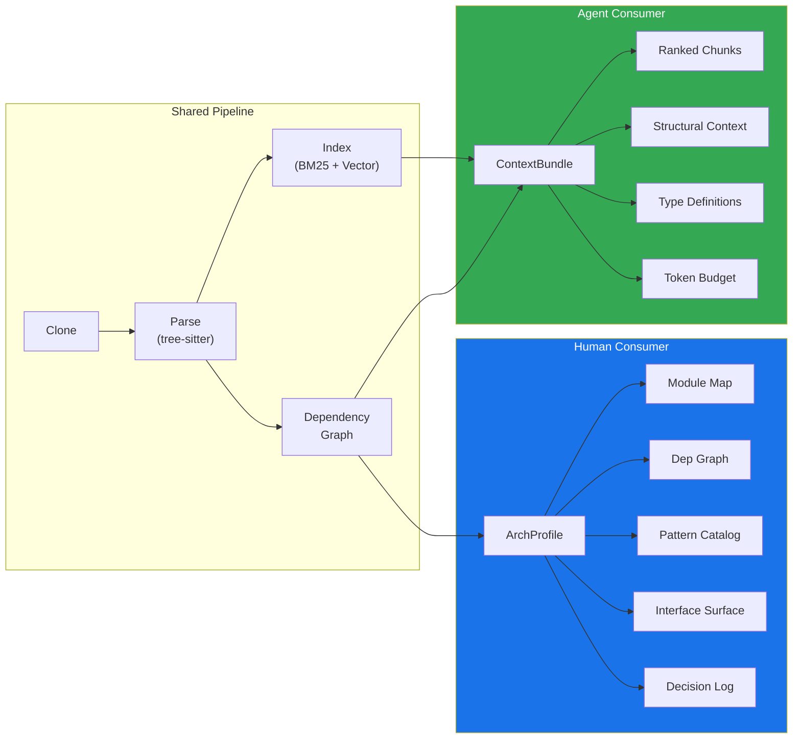
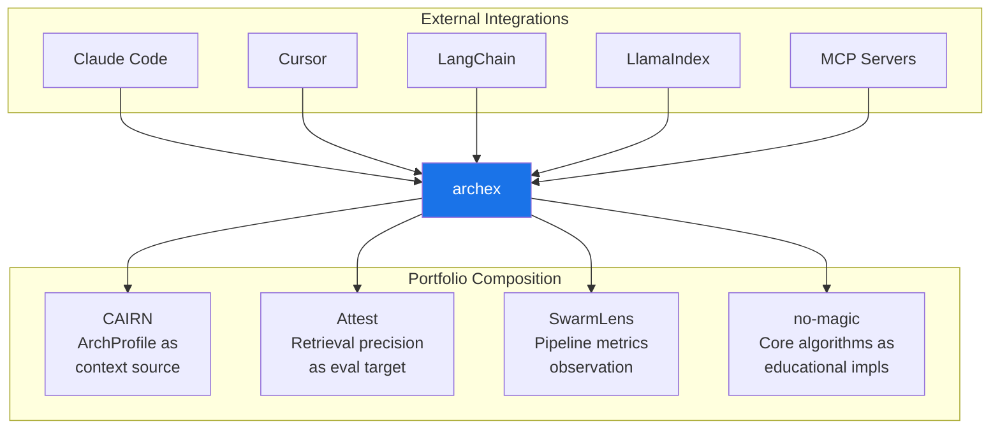

# archex — System Overview

> **Architecture Extraction & Codebase Intelligence for the Agentic Era**

---

## 1. What Is archex?

archex is a Python library and CLI that transforms any Git repository into structured architectural intelligence and token-budget-aware code context. It serves two distinct consumers from a single index:

- **Human architects** receive an `ArchProfile` — module boundaries, dependency graphs, detected patterns, interface surfaces, and inferred trade-offs — enabling informed design decisions without reading thousands of lines of source.
- **AI agents** receive a `ContextBundle` — relevance-ranked, syntax-aligned code chunks annotated with structural metadata, assembled to fit within a specified token budget — enabling accurate reimplementation without access to the original repo.

archex is framework-agnostic, LLM-optional, and multi-language. It is designed to be called by any agent framework (LangChain, LlamaIndex, Mastra, Claude Code, Cursor) as a tool, embedded in CI pipelines for architectural drift detection, or used interactively by developers via its CLI.

---

## 2. The Problem

### 2.1 The Shifting Developer Workflow

The division of labor between humans and AI agents is stabilizing around a clear boundary:

```text
Human Developer                          AI Agent
─────────────────                        ────────────
System design                            Implementation
Architecture decisions                   Code generation
Pattern selection                        Execution path tracing
Trade-off evaluation                     Dependency wiring
Interface contracts                      Test writing
```

When a developer needs to understand how an external codebase solves a problem — to inform a design decision or to give their agent implementation context — the current tooling fails on both sides of this boundary.

### 2.2 Current Tool Landscape

| Tool                     | What It Does                                  | Where It Falls Short                                               |
| ------------------------ | --------------------------------------------- | ------------------------------------------------------------------ |
| **Manual code reading**  | Clone, grep, trace                            | High fidelity, but hours of work per feature                       |
| **repo2txt / gitingest** | Flatten repo → text dump                      | No intelligence, no structure, no token management                 |
| **depresearch**          | Agent reads files, produces prose walkthrough | No retrieval strategy; output is human-only; breaks on large repos |
| **Cursor @codebase**     | Vector-indexed search over your project       | Your project only; no foreign repo support                         |
| **DeepWiki**             | Pre-generated AI documentation                | Not query-driven; no cross-repo; no agent-consumable format        |
| **Perplexity / ChatGPT** | Web search with citations                     | No source-level analysis; relies on docs and blog posts            |
| **Code-Graph-RAG**       | Knowledge graph over codebase                 | Heavy infrastructure (Neo4j); not designed as a library            |

**The gap:** No tool produces _both_ architectural intelligence for human design decisions _and_ token-efficient code context for agent consumption. No tool provides structural retrieval (dependency-aware, module-aware) as opposed to pure text similarity. No tool manages token budgets or provides deterministic, LLM-free structural analysis.

### 2.3 What archex Solves

archex fills this gap with three core operations:

```text
analyze(repo)         → ArchProfile      → Human designs with architectural clarity
query(repo, question) → ContextBundle    → Agent implements with precise context
compare(A, B)         → ComparisonResult → Both evaluate alternatives with evidence
```

---

## 3. Design Philosophy

### 3.1 Framework-Agnostic

archex has zero coupling to any agent framework. It produces structured data (`ArchProfile`, `ContextBundle`) that any consumer can ingest — LangChain retrievers, LlamaIndex query engines, Claude Code MCP tools, raw Python scripts, or CLI output piped to stdout. Agent frameworks are integration targets, not dependencies.

### 3.2 LLM-Optional

The entire structural pipeline — AST parsing, symbol extraction, import resolution, dependency graph construction, module boundary detection, pattern recognition, chunking, BM25 indexing, token budget assembly — runs without any LLM calls. This means:

- **Deterministic:** Same repo + same config = same output, every time
- **Fast:** No API latency in the critical path
- **Free:** No token cost for structural analysis
- **Testable:** Every stage produces inspectable intermediate outputs

LLMs are used only for enrichment (module descriptions, trade-off inference, cross-repo comparison) and are always opt-in behind a `Provider` interface.

### 3.3 Retrieval-First

The primary value proposition is _getting the right code into the right context window at the right cost_. This means:

- **AST-aware chunking** that respects syntax boundaries (never splits a function in half)
- **Dependency-aware retrieval** that includes structurally related code, not just textually similar code
- **Token budget management** that packs maximum relevant context into a fixed token budget
- **Structural centrality scoring** that prioritizes architecturally important code over peripheral utilities

### 3.4 Multi-Language from Day One

Tree-sitter provides language-agnostic AST parsing across 100+ languages. archex's core algorithms operate on abstract symbol types and AST node categories, not language-specific heuristics. Language-specific knowledge (import conventions, module systems, entry point patterns) is isolated behind a `LanguageAdapter` protocol with ~150 lines per language.

**Shipped adapters:** Python, TypeScript/JavaScript, Go, Rust, Java, Kotlin, C#, Swift.

### 3.5 No Magic

Every operation is explicit, composable, and inspectable:

- No hidden LLM calls. If an operation uses an LLM, the user opted in.
- No implicit caching. Caching is explicit via configuration.
- No background processes. The library is synchronous by default, async opt-in.
- No global state. Every function takes explicit inputs and returns explicit outputs.

---

## 4. Core Concepts

### 4.1 The Two-Consumer Model

archex's central insight is that codebase understanding has two distinct consumers with different needs:



These share the same parse/index pipeline but diverge at the output layer. The `ArchProfile` aggregates and analyzes the full graph. The `ContextBundle` retrieves a focused subset optimized for a specific question and token budget.

### 4.2 Structural vs. Semantic Retrieval

Most code search tools rely on semantic similarity (embedding vectors). This finds _textually similar_ code but misses _structurally related_ code:

| Query                 | Semantic Retrieval Returns                  | Structural Retrieval Returns                                                                                              |
| --------------------- | ------------------------------------------- | ------------------------------------------------------------------------------------------------------------------------- |
| "How does auth work?" | All functions with "auth" in the name       | The auth middleware + the session store it calls + the user model it validates against + the config it reads              |
| "Connection pooling"  | Functions mentioning "pool" or "connection" | The pool class + its factory + the transport that uses it + the config that bounds it + the health check that monitors it |

archex combines both: BM25 (keyword) and optional vector search (semantic) for initial retrieval, then **expands results along the dependency graph** to include structurally related code. This is the key quality advantage over pure vector search.

### 4.3 Token Budget Assembly

Context windows are finite and expensive. archex's `query()` function doesn't just return "relevant files" — it assembles a precisely-sized context bundle:

```text
Given: question, token_budget=8000

1. RETRIEVE: BM25 + vector search → 50 candidate chunks
2. EXPAND: Walk 1-hop dependencies for each candidate → 120 chunks
3. RANK: score = relevance × 0.6 + structural_centrality × 0.2 + type_coverage × 0.2
4. PACK: Greedy bin-packing into budget
   - Add highest-ranked chunk (350 tokens) → 7650 remaining
   - Add its type definitions (120 tokens) → 7530 remaining
   - Skip chunk with >80% overlap with already-included chunk
   - Continue until budget exhausted
5. ATTACH: File map, module context, dependency summary
6. RETURN: ContextBundle (7,847 tokens, 12 chunks, 3 type defs)
```

The result is a self-contained, precisely-sized context block that an agent can consume directly — no further processing needed.

### 4.4 ArchProfile Structure

The `ArchProfile` is a complete architectural map of a codebase:

| Component             | What It Contains                                                        | How It's Produced                                             |
| --------------------- | ----------------------------------------------------------------------- | ------------------------------------------------------------- |
| **Module Map**        | Logical module boundaries, files per module, exports, inter-module deps | Community detection (Louvain) on file-level dependency graph  |
| **Dependency Graph**  | File-level and symbol-level edges (imports, calls, inherits, uses_type) | AST import resolution + symbol reference tracing              |
| **Pattern Catalog**   | Detected architectural patterns with confidence scores and evidence     | Rule-based detection on graph structure + AST signatures      |
| **Interface Surface** | Public APIs, type definitions, exported contracts                       | Export classification via `LanguageAdapter`                   |
| **Decision Log**      | Inferred trade-offs and design rationale                                | Structural evidence (deterministic) + optional LLM enrichment |
| **Stats**             | Lines, files, language breakdown, dependency counts                     | Direct enumeration                                            |

### 4.5 Language Adapter System

Each supported language implements a protocol that encapsulates language-specific parsing logic:

```text
LanguageAdapter Protocol
├── extract_symbols()      → Functions, classes, types, exports from AST
├── parse_imports()        → Import statements with module/symbol info
├── resolve_import()       → Map import statement → file path in repo
├── detect_entry_points()  → Identify main, __init__, index, etc.
└── classify_export()      → Public vs. internal vs. private
```

Core algorithms (chunking, graph construction, module detection, pattern recognition) operate on the abstract output of these methods. Adding a new language means implementing ~150 lines of adapter code and registering it — the rest of the pipeline works unchanged.

---

## 5. Usage Patterns

### 5.1 As a Python Library

```python
from archex import analyze, query, compare

# Architectural analysis for human decision-making
profile = analyze("https://github.com/encode/httpx")
for module in profile.module_map:
    print(f"{module.name}: {module.responsibility}")
for pattern in profile.pattern_catalog:
    print(f"[{pattern.confidence:.0%}] {pattern.name}")

# Implementation context for agent consumption
bundle = query(
    "https://github.com/encode/httpx",
    "How does connection pooling work?",
    token_budget=8000,
)
agent_prompt = bundle.to_prompt(format="xml")

# Cross-repo architectural comparison
result = compare(
    "https://github.com/encode/httpx",
    "https://github.com/psf/requests",
    dimensions=["error_handling", "connection_management"],
)
```

### 5.2 As a CLI

```bash
archex analyze https://github.com/encode/httpx --format markdown
archex query https://github.com/encode/httpx "How does pooling work?" --budget 8000
archex compare httpx requests --dimensions error_handling,api_surface
archex cache list
archex cache clean --max-age 168
```

### 5.3 As an Agent Tool

```python
# MCP tool for Claude Code / Claude Desktop
@mcp.tool()
def query_repo(repo_url: str, question: str, budget: int = 8000) -> str:
    return query(repo_url, question, token_budget=budget).to_prompt()

# LangChain retriever
from archex.integrations.langchain import ArchexRetriever
retriever = ArchexRetriever(source="https://github.com/encode/httpx")

# Generic tool for any agent framework
def research(repo: str, question: str) -> str:
    return query(repo, question, token_budget=8000).to_prompt()
```

### 5.4 As a Sub-Agent via CLI

Any coding agent can shell out to archex:

```text
Parent Agent (Claude Code, Cursor, etc.)
├── needs to understand how httpx handles connection pooling
├── shells out: archex query https://github.com/encode/httpx "connection pooling" --budget 8000 --format xml
├── receives: structured XML context block on stdout
└── continues implementing with precise foreign-repo context
```

---

## 6. Dependency Philosophy

archex follows a minimal-dependency strategy:

**Core (always installed):**

| Dependency                        | Purpose                                 | Size  |
| --------------------------------- | --------------------------------------- | ----- |
| `tree-sitter` + language grammars | AST parsing                             | ~5MB  |
| `tiktoken`                        | Token counting for budget management    | ~3MB  |
| `pydantic`                        | Data model validation and serialization | ~5MB  |
| `networkx`                        | Dependency graph + community detection  | ~15MB |
| `click`                           | CLI framework                           | ~1MB  |

**Optional extras:**

| Extra                   | Dependencies                | Purpose                                      |
| ----------------------- | --------------------------- | -------------------------------------------- |
| `archex[vector]`        | `onnxruntime`, `tokenizers` | Local embedding via Nomic Embed Code (~50MB) |
| `archex[vector-torch]`  | `sentence-transformers`     | Full torch-backed embeddings (~2GB)          |
| `archex[voyage]`        | `voyageai`                  | Voyage Code API embeddings                   |
| `archex[openai]`        | `openai`                    | OpenAI API embeddings + LLM enrichment       |
| `archex[anthropic]`     | `anthropic`                 | Anthropic API LLM enrichment                 |
| `archex[language-pack]` | `tree-sitter-language-pack` | Additional grammars (Swift)                  |
| `archex[all]`           | All optional deps           | Everything                                   |

Core grammar dependencies include `tree-sitter-java`, `tree-sitter-kotlin`, and `tree-sitter-c-sharp` in addition to the original four. Swift uses `tree-sitter-language-pack` (optional extra).

No SQLAlchemy, no FastAPI, no heavy frameworks. SQLite via stdlib `sqlite3`. Git operations via `git` CLI (assumed installed). HTTP via stdlib `urllib` where needed.

---

## 7. Ecosystem Fit

archex is designed to compose with a broader toolkit:



| System        | Integration                                                                                                                                                                          |
| ------------- | ------------------------------------------------------------------------------------------------------------------------------------------------------------------------------------ |
| **CAIRN**     | `ArchProfile` objects serve as context sources. When a developer's agent needs to reference how another project solved a problem, CAIRN retrieves from cached archex indexes.        |
| **Attest**    | Retrieval quality is directly testable via the graduated assertion pipeline. "Given this query against this repo, does the ContextBundle contain the correct files?"                 |
| **SwarmLens** | When agent teams use archex as a sub-agent tool, SwarmLens observes token consumption, retrieval precision, cache hit rates, and latency per pipeline stage.                         |
| **no-magic**  | Core algorithms (Louvain community detection, BM25 scoring, AST-aware chunking, PageRank centrality, greedy bin-packing) are candidates for single-file educational implementations. |

---

## 8. What archex Is Not

- **Not an AI agent.** It has no autonomous decision-making, tool-use loops, or planning capabilities. It is a library that agents call.
- **Not a code editor.** Read-only by design. It never modifies source code.
- **Not a documentation generator.** Output is structured data, not prose. Consumers (humans or agents) interpret the data.
- **Not a code search engine.** It doesn't provide a search UI. It provides a retrieval API that search can be built on.
- **Not a replacement for reading code.** For deep debugging or security auditing, there is no substitute for direct source reading. archex accelerates the "understand enough to make a design decision" workflow.

---

## 9. Guiding Constraints

| Constraint                 | Rationale                                                                        |
| -------------------------- | -------------------------------------------------------------------------------- |
| Python 3.11+               | Minimum version for `StrEnum`, `tomllib`, modern typing features                 |
| Git required on PATH       | Safer and more reliable than `pygit2` or `dulwich` for clone/checkout operations |
| SQLite for all persistence | Single-file, zero-config, stdlib-backed. No external databases.                  |
| Token counts via tiktoken  | Industry standard. `cl100k_base` encoding as default, configurable per model.    |
| ONNX for local embeddings  | 50MB vs 2GB for torch. Critical for a CLI tool installed globally.               |
| No async in public API     | Sync by default. Async internals where beneficial (e.g., parallel file parsing). |
