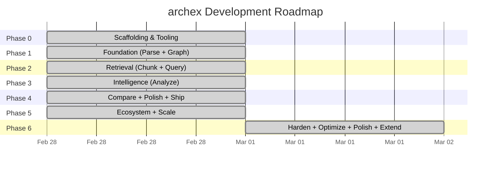

# archex — Roadmap

> Phased execution plan from scaffolding to production release.

---

## Timeline Overview



| Phase                              | Duration | Goal                                                                            | Key Deliverable                                          | Status       |
| ---------------------------------- | -------- | ------------------------------------------------------------------------------- | -------------------------------------------------------- | ------------ |
| **0 — Scaffold**                   | ~1 week  | Repo, CI, project structure, deps, test harness                                 | Empty but buildable project with full tooling            | ✅ Complete  |
| **1 — Foundation**                 | ~3 weeks | Parse any Python repo, extract symbols, build dep graph                         | `analyze()` returns structural ArchProfile (Python only) | ✅ Complete  |
| **2 — Retrieval**                  | ~3 weeks | AST-aware chunking, BM25 index, token-budget context assembly                   | `query()` returns ContextBundle with budget packing      | ✅ Complete  |
| **3 — Intelligence**               | ~3 weeks | Module detection, pattern recognition, LLM enrichment, TypeScript adapter       | Full `analyze()` with patterns + modules + enrichment    | ✅ Complete  |
| **4 — Compare + Ship**             | ~3 weeks | Cross-repo comparison, Go/Rust adapters, vector index, CLI polish, PyPI publish | `archex` v0.1.0 on PyPI with 4 language adapters         | ✅ Complete  |
| **5 — Ecosystem**                  | ~3 weeks | MCP integration, framework adapters, Attest evals, content pipeline             | Integrations with Claude Code, LangChain, CAIRN          | ✅ Complete  |
| **6 — Harden, Optimize, Polish, Extend** | ~1 week  | Security hardening, performance optimization, code polish, extensibility APIs   | v0.3.0 — 538 tests, 84% coverage, plugin entry points   | ✅ Complete  |

---

## Phase 0 — Scaffold

> **Goal:** A fully configured, empty-but-buildable project with CI, testing, linting, packaging, and documentation infrastructure. Zero application code, but every engineer quality-of-life tool is in place.

### Deliverables

| Task                   | Details                                                                                                                                       |
| ---------------------- | --------------------------------------------------------------------------------------------------------------------------------------------- |
| **Repository**         | `github.com/[org]/archex`, MIT license, `.gitignore`, `AGENTS.md`                                                                             |
| **Project config**     | `pyproject.toml` with `[project]`, `[build-system]` (hatchling), `[project.optional-dependencies]`, `[project.scripts]`                       |
| **Package structure**  | Full directory tree from system design (all `__init__.py` files, empty modules with docstrings and `TODO` comments)                           |
| **Dependency pinning** | `uv.lock` for reproducible installs. Core deps: `tree-sitter`, `tiktoken`, `pydantic`, `networkx`, `click`                                    |
| **Testing**            | `pytest` + `pytest-cov`. `tests/` mirror of `src/archex/`. Fixtures directory with small test repos (5-10 files each, committed as test data) |
| **Linting**            | `ruff` for linting + formatting. `pyright` for type checking. Configured in `pyproject.toml`                                                  |
| **CI**                 | GitHub Actions: lint → typecheck → test → build on every push. Python 3.11 + 3.12 matrix                                                      |
| **Documentation**      | `README.md` (project overview + quick start). `OVERVIEW.md`, `SYSTEM_DESIGN.md`, `ROADMAP.md` (these documents)                               |
| **CLI stub**           | `archex --version` and `archex --help` working via click                                                                                      |
| **Pre-commit**         | `pre-commit` config with ruff, pyright, and trailing whitespace hooks                                                                         |

### Project Configuration

```toml
# pyproject.toml
[project]
name = "archex"
version = "0.1.0"
description = "Architecture extraction & codebase intelligence for the agentic era"
readme = "README.md"
license = { text = "MIT" }
requires-python = ">=3.11"
authors = [{ name = "Tom" }]
keywords = ["architecture", "codebase", "retrieval", "rag", "ast", "code-intelligence"]
classifiers = [
    "Development Status :: 3 - Alpha",
    "Intended Audience :: Developers",
    "Topic :: Software Development :: Libraries",
    "License :: OSI Approved :: MIT License",
    "Programming Language :: Python :: 3.11",
    "Programming Language :: Python :: 3.12",
]

dependencies = [
    "tree-sitter>=0.23",
    "tree-sitter-python>=0.23",
    "tree-sitter-javascript>=0.23",
    "tree-sitter-typescript>=0.23",
    "tree-sitter-go>=0.23",
    "tree-sitter-rust>=0.23",
    "tiktoken>=0.7",
    "pydantic>=2.7",
    "networkx>=3.3",
    "click>=8.1",
]

[project.optional-dependencies]
vector = ["onnxruntime>=1.17", "tokenizers>=0.15"]
vector-torch = ["sentence-transformers>=2.6"]
voyage = ["voyageai>=0.3"]
openai = ["openai>=1.0"]
anthropic = ["anthropic>=0.30"]
all = ["archex[vector,voyage,openai,anthropic]"]
dev = [
    "pytest>=8.0",
    "pytest-cov>=5.0",
    "ruff>=0.5",
    "pyright>=1.1",
    "pre-commit>=3.7",
]

[project.scripts]
archex = "archex.cli.main:cli"

[build-system]
requires = ["hatchling"]
build-backend = "hatchling.build"

[tool.hatch.build.targets.wheel]
packages = ["src/archex"]

[tool.ruff]
target-version = "py311"
line-length = 100

[tool.ruff.lint]
select = ["E", "F", "I", "N", "UP", "B", "SIM", "TCH"]

[tool.pyright]
pythonVersion = "3.11"
typeCheckingMode = "strict"

[tool.pytest.ini_options]
testpaths = ["tests"]
addopts = "--cov=archex --cov-report=term-missing"
```

### Test Fixture Repos

Create minimal test repos committed as fixtures under `tests/fixtures/`:

```text
tests/fixtures/
├── python_simple/           # 5 Python files, basic imports, 1 class hierarchy
│   ├── main.py
│   ├── models.py
│   ├── utils.py
│   ├── services/
│   │   ├── __init__.py
│   │   └── auth.py
│   └── pyproject.toml
│
├── python_patterns/         # Python repo with known architectural patterns
│   ├── middleware.py        # Middleware chain pattern
│   ├── plugins.py           # Plugin registry pattern
│   ├── events.py            # Event bus pattern
│   └── ...
│
├── typescript_simple/       # 5 TypeScript files, ES module imports
│   ├── src/
│   │   ├── index.ts
│   │   ├── types.ts
│   │   ├── utils.ts
│   │   └── handlers/
│   │       └── auth.ts
│   ├── package.json
│   └── tsconfig.json
│
└── monorepo_simple/         # 2 sub-packages with cross-package imports
    ├── packages/
    │   ├── core/
    │   │   ├── src/
    │   │   │   └── index.py
    │   │   └── pyproject.toml
    │   └── cli/
    │       ├── src/
    │       │   └── main.py  # imports from core
    │       └── pyproject.toml
    └── pyproject.toml
```

### Acceptance Criteria

- [x] `uv sync` installs all deps cleanly on Python 3.11 and 3.12
- [x] `pytest` runs (0 tests, 0 failures — test infrastructure works)
- [x] `ruff check .` passes
- [x] `pyright .` passes
- [x] `archex --version` prints version
- [x] `archex --help` prints help with all subcommand stubs
- [ ] GitHub Actions CI passes on push
- [x] `uv build` produces a wheel
- [x] All fixture repos are committed and accessible in tests

---

## Phase 1 — Foundation

> **Goal:** Parse any Python repository, extract all symbols and imports, resolve internal dependencies, build a dependency graph, and produce a basic `ArchProfile` with stats and dependency information. This is the structural skeleton that all subsequent phases build on.

### Deliverables

#### 1.1 — Acquire Module

| Component              | Implementation                                                                                                                                                                                |
| ---------------------- | --------------------------------------------------------------------------------------------------------------------------------------------------------------------------------------------- |
| `acquire/git.py`       | `clone_repo(url, target_dir, shallow=True)` using `subprocess.run(["git", "clone", ...])`. Returns `Path`. Error handling for network failures, private repos, invalid URLs.                  |
| `acquire/local.py`     | `open_local(path)` validates the path exists and is a git repo (has `.git/`). Returns `Path`.                                                                                                 |
| `acquire/discovery.py` | `discover_files(repo_path, languages, ignores)` walks the file tree, applies `.gitignore` + default ignores, detects language per file via extension mapping. Returns `list[DiscoveredFile]`. |

**Tests:**

- Clone a public repo (use a small one, e.g., `https://github.com/pallets/click` with shallow clone) — integration test, network-gated
- Open local fixture repo — unit test
- File discovery with ignore rules — unit test against fixtures
- Language detection accuracy — unit test

#### 1.2 — Parse Module (Python Adapter)

| Component                  | Implementation                                                                                                                                                              |
| -------------------------- | --------------------------------------------------------------------------------------------------------------------------------------------------------------------------- |
| `parse/engine.py`          | `TreeSitterEngine` class: load tree-sitter language, parse file bytes to AST tree. Manages language grammar loading.                                                        |
| `parse/adapters/base.py`   | `LanguageAdapter` protocol definition.                                                                                                                                      |
| `parse/adapters/python.py` | Full Python adapter: `extract_symbols()`, `parse_imports()`, `resolve_import()`, `detect_entry_points()`, `classify_visibility()`. Uses tree-sitter queries for extraction. |
| `parse/symbols.py`         | `extract_symbols(files, adapters)` — orchestrates per-file symbol extraction.                                                                                               |
| `parse/imports.py`         | `parse_imports(files, adapters)` + `resolve_imports(imports, file_map)` — maps imports to file paths.                                                                       |

**Python-specific parsing details:**

```python
# Visibility classification for Python
def classify_visibility(symbol: Symbol) -> Visibility:
    if symbol.name.startswith("__") and symbol.name.endswith("__"):
        return Visibility.PUBLIC    # Dunder methods are public
    if symbol.name.startswith("_"):
        return Visibility.PRIVATE
    if symbol.file_path.endswith("__init__.py"):
        # Check __all__ for explicit exports
        ...
    return Visibility.PUBLIC

# Entry point detection for Python
def detect_entry_points(files: list[ParsedFile]) -> list[str]:
    entries = []
    for f in files:
        if f.path.endswith("__main__.py"):
            entries.append(f.path)
        for sym in f.symbols:
            if sym.name == "main" and sym.kind == SymbolKind.FUNCTION:
                entries.append(f"{f.path}:{sym.name}")
        # Check for `if __name__ == "__main__":` pattern
        ...
    return entries
```

**Tests:**

- Parse Python fixture repo, verify symbol count and types
- Parse class with methods, verify parent relationships
- Parse all import styles (`import x`, `from x import y`, `from . import z`)
- Resolve relative imports correctly
- Detect entry points in fixture
- Classify visibility correctly (public, private, dunder)

#### 1.3 — Dependency Graph

| Component        | Implementation                                                                                                                                                          |
| ---------------- | ----------------------------------------------------------------------------------------------------------------------------------------------------------------------- |
| `index/graph.py` | `DependencyGraph` class wrapping NetworkX `DiGraph`. `from_parsed_files()` constructor. File-level and symbol-level edges. `to_sqlite()` / `from_sqlite()` persistence. |

**Tests:**

- Build graph from fixture, verify edge count
- Check transitive deps (A imports B imports C → A transitively depends on C)
- Check reverse deps
- Serialize to SQLite and round-trip

#### 1.4 — Basic ArchProfile

| Component          | Implementation                                                                                                                                                                                                              |
| ------------------ | --------------------------------------------------------------------------------------------------------------------------------------------------------------------------------------------------------------------------- |
| `serve/profile.py` | `build_profile(repo_metadata, parsed_files, graph)` assembles a basic ArchProfile with: repo metadata, stats, dependency graph summary, interface surface (public symbols). No module detection or pattern recognition yet. |
| `api.py`           | `analyze(source)` top-level function. Runs acquire → parse → graph → profile pipeline.                                                                                                                                      |

**Tests:**

- `analyze()` on Python fixture returns ArchProfile with correct stats
- ArchProfile serializes to JSON and Markdown
- Interface surface correctly identifies public functions/classes

#### 1.5 — Data Models (Complete)

| Component       | Implementation                                                                                                                             |
| --------------- | ------------------------------------------------------------------------------------------------------------------------------------------ |
| `models.py`     | All Pydantic models from the system design. Complete type definitions for ArchProfile, ContextBundle (stub), CodeChunk, Symbol, Edge, etc. |
| `exceptions.py` | Full exception hierarchy.                                                                                                                  |

### Phase 1 Acceptance Criteria

- [x] `analyze("https://github.com/pallets/click")` returns a valid ArchProfile
- [x] ArchProfile contains correct file count, line count, language breakdown
- [x] All Python symbols extracted (functions, classes, methods, types)
- [x] All imports parsed and internal imports resolved to file paths
- [x] Dependency graph has correct file-level and symbol-level edges
- [x] ArchProfile.interface_surface lists public APIs correctly
- [x] `archex analyze <url> --format json` outputs valid JSON to stdout
- [x] All tests pass, coverage > 80% for new code
- [x] Local fixture tests run without network access

### Known Risks

| Risk                                                                                                   | Mitigation                                                                                        |
| ------------------------------------------------------------------------------------------------------ | ------------------------------------------------------------------------------------------------- |
| tree-sitter grammar version mismatches across OSes                                                     | Pin grammar package versions in deps. Test in CI on Linux + macOS.                                |
| Python import resolution is complex (namespace packages, `sys.path` manipulation, conditional imports) | Start with straightforward resolution. Log warnings for unresolvable imports rather than failing. |
| Large repos slow to parse                                                                              | Implement parallel parsing in this phase even if not strictly needed yet.                         |

---

## Phase 2 — Retrieval

> **Goal:** AST-aware chunking, BM25 index, token-budget-aware context assembly. The `query()` function becomes operational — developers and agents can ask questions and get back precisely-sized code context.

### Deliverables

#### 2.1 — AST-Aware Chunker

| Component          | Implementation                                                                                                                                                                                                                   |
| ------------------ | -------------------------------------------------------------------------------------------------------------------------------------------------------------------------------------------------------------------------------- |
| `index/chunker.py` | `ASTChunker` class. Takes `ParsedFile` + `IndexConfig`, produces `list[CodeChunk]`. Implements the recursive AST walk, boundary alignment, import prepending, decorator inclusion, comment association, and small-chunk merging. |

**Chunking validation tests:**

- A function chunk includes its decorator and docstring
- A class chunk includes `__init__` when the class is chunked per-method
- Chunks never split a function body mid-statement
- Import context prepended correctly (only relevant imports)
- Small adjacent chunks merged when below threshold
- Token counts are accurate (verified against tiktoken)

#### 2.2 — BM25 Index

| Component       | Implementation                                                                                                                                         |
| --------------- | ------------------------------------------------------------------------------------------------------------------------------------------------------ |
| `index/bm25.py` | `BM25Index` class wrapping SQLite FTS5. `build(chunks)`, `search(query, top_k)` methods. Index stored in the same SQLite database as chunks and edges. |

**Tests:**

- Build index from fixture chunks
- Query returns relevant chunks ranked by BM25 score
- Query for function name returns the correct function chunk
- Query for concept returns semantically related chunks

#### 2.3 — Index Store (Persistence)

| Component        | Implementation                                                                                                                               |
| ---------------- | -------------------------------------------------------------------------------------------------------------------------------------------- |
| `index/store.py` | `IndexStore` class managing the SQLite database. Schema creation, chunk insertion, edge insertion, metadata storage. Transaction management. |
| `cache.py`       | `CacheManager` class. Cache key generation, TTL enforcement, invalidation by commit hash, `clean()` and `info()` methods.                    |

**Tests:**

- Write index, close, reopen, verify data integrity
- Cache invalidation when commit changes
- Cache TTL enforcement
- `archex cache list` and `archex cache clean` commands

#### 2.4 — Context Assembly

| Component                     | Implementation                                                                                                                                               |
| ----------------------------- | ------------------------------------------------------------------------------------------------------------------------------------------------------------ |
| `serve/context.py`            | `assemble_context(index, graph, question, token_budget, strategy)` — implements the full retrieval → expand → rank → pack pipeline. Returns `ContextBundle`. |
| `serve/renderers/xml.py`      | XML prompt renderer with file-map preamble, module context, typed chunks, and dependency summary.                                                            |
| `serve/renderers/markdown.py` | Markdown renderer for human-readable output.                                                                                                                 |
| `serve/renderers/json.py`     | JSON renderer for programmatic consumption.                                                                                                                  |

**Tests:**

- `assemble_context()` returns a ContextBundle within token budget
- Token count in returned bundle ≤ specified budget
- `truncated` flag set correctly when budget forces omission
- Chunks ranked by composite score (not just BM25)
- Type definitions included when referenced by chunks
- XML renderer produces valid, parseable XML
- Structural context includes correct file tree and module info

#### 2.5 — Top-Level Query API

| Component          | Implementation                                                                                                                  |
| ------------------ | ------------------------------------------------------------------------------------------------------------------------------- |
| `api.py`           | `query(source, question, token_budget, strategy, ...)` top-level function. Uses cached index if available, builds fresh if not. |
| `cli/query_cmd.py` | `archex query <url> "question" --budget 8000 --format xml`                                                                      |

### Phase 2 Acceptance Criteria

- [x] `query("https://github.com/pallets/click", "How does command registration work?", token_budget=4000)` returns a valid ContextBundle
- [x] ContextBundle token count ≤ specified budget
- [x] Chunks are syntax-aligned (no split functions/classes)
- [x] `to_prompt(format="xml")` produces well-formed XML
- [x] BM25 retrieval returns relevant results for keyword queries
- [x] Index is cached and reused on subsequent queries to the same repo
- [x] `archex query` CLI command works end-to-end
- [x] All tests pass, coverage > 80%

---

## Phase 3 — Intelligence

> **Goal:** Module boundary detection, architectural pattern recognition, TypeScript adapter, optional LLM enrichment. The `analyze()` function produces a full-fidelity ArchProfile.

### Deliverables

#### 3.1 — Module Boundary Detection

| Component            | Implementation                                                                                                                                                                            |
| -------------------- | ----------------------------------------------------------------------------------------------------------------------------------------------------------------------------------------- |
| `analyze/modules.py` | `detect_modules(graph, files, directory_prior)` — Louvain community detection on file-level dependency graph with directory-based weighting. Returns `list[Module]` with cohesion scores. |

**Tests:**

- Fixture with 2 clear modules → detects 2 modules
- Monorepo fixture → sub-packages detected as top-level modules
- Cohesion scores reflect coupling density
- Module names inferred from common path prefix

#### 3.2 — Pattern Recognition

| Component             | Implementation                                                                                                                                               |
| --------------------- | ------------------------------------------------------------------------------------------------------------------------------------------------------------ |
| `analyze/patterns.py` | Pattern detector registry + shipped detectors. `detect_patterns(graph, symbols, modules)` runs all registered detectors and returns `list[DetectedPattern]`. |

**Ship detectors for Phase 3:**

- Middleware Chain
- Plugin / Extension System
- Event Bus / Pub-Sub
- Repository / DAO
- Strategy Pattern

**Remaining detectors (Phase 4 or later):**

- Builder Pattern
- Dependency Injection
- Pipeline / Chain of Responsibility
- Factory Pattern
- Singleton / Module-Level State

**Tests:**

- Pattern fixture repo with known patterns → each detector fires correctly
- Confidence scores reflect evidence strength
- No false positives on repos without the pattern
- Evidence points to correct file paths and line numbers

#### 3.3 — TypeScript / JavaScript Adapter

| Component                      | Implementation                                                                                                                                                                           |
| ------------------------------ | ---------------------------------------------------------------------------------------------------------------------------------------------------------------------------------------- |
| `parse/adapters/typescript.py` | Full TypeScript + JavaScript adapter. Handles: ES modules (`import/export`), CommonJS (`require/module.exports`), TypeScript types/interfaces/enums, JSX/TSX, default vs. named exports. |

**TS-specific complexity:**

- `import` vs `require` detection
- `export default` vs named exports
- Type-only imports (`import type { Foo }`)
- Re-exports (`export { x } from './y'`)
- `index.ts` resolution (`import from './utils'` → `./utils/index.ts`)
- Declaration files (`.d.ts`) as type-only sources

**Tests:**

- Parse TypeScript fixture, verify all symbols
- Parse mixed JS + TS project
- Resolve ES module imports correctly
- Handle re-exports
- Classify exports via `export` keyword presence

#### 3.4 — LLM Enrichment (Optional)

| Component                | Implementation                                                                                                                                                                                                         |
| ------------------------ | ---------------------------------------------------------------------------------------------------------------------------------------------------------------------------------------------------------------------- |
| `providers/base.py`      | `LLMProvider` protocol with `complete()` and `complete_structured()` methods.                                                                                                                                          |
| `providers/anthropic.py` | Anthropic Claude provider implementation.                                                                                                                                                                              |
| `providers/openai.py`    | OpenAI provider implementation.                                                                                                                                                                                        |
| `analyze/decisions.py`   | `infer_decisions(profile, provider)` — given a structural ArchProfile, use LLM to infer trade-off rationale. Prompt includes module map + pattern evidence. Returns `list[ArchDecision]` with `source="llm_inferred"`. |

**Enrichment prompts are tightly scoped:**

- Module responsibility: "Given these files and exports, describe this module's responsibility in one sentence."
- Trade-off inference: "Given this pattern evidence, what trade-off does this design choice represent? What alternative could have been chosen?"
- No open-ended generation. Structured output (Pydantic schema) enforced.

**Tests:**

- Enrichment with mock provider returns correctly structured data
- Enrichment disabled by default (`enrich=False`)
- Enrichment failure → graceful fallback to structural-only

#### 3.5 — Full ArchProfile Assembly

| Component               | Implementation                                                                                                         |
| ----------------------- | ---------------------------------------------------------------------------------------------------------------------- |
| `serve/profile.py`      | Updated `build_profile()` to include module map, pattern catalog, and optional enriched decisions.                     |
| `analyze/interfaces.py` | `extract_interfaces(symbols, graph)` — identify public API surface with usage counts, parameter types, and docstrings. |

### Phase 3 Acceptance Criteria

- [x] Module detection correctly identifies 2+ modules in a multi-module repo
- [x] Pattern detection finds middleware chain in Express-like fixture
- [x] TypeScript adapter parses all common import/export styles
- [x] `analyze()` with `enrich=True` + provider produces enriched decisions
- [x] `analyze()` with `enrich=False` produces complete structural profile (no LLM calls)
- [x] Full ArchProfile renders as readable Markdown with Mermaid dependency diagrams
- [x] All tests pass, coverage > 80%

---

## Phase 4 — Compare + Polish + Ship

> **Goal:** Cross-repo comparison, Go and Rust adapters, optional vector index, CLI UX polish, documentation, and PyPI release as v0.1.0.

### Deliverables

#### 4.1 — Cross-Repo Comparison

| Component            | Implementation                                                                                                                                                                        |
| -------------------- | ------------------------------------------------------------------------------------------------------------------------------------------------------------------------------------- |
| `serve/compare.py`   | `compare_repos(source_a, source_b, dimensions, provider)` — analyzes both repos, extracts dimension-specific evidence, uses LLM to synthesize comparison. Returns `ComparisonResult`. |
| `cli/compare_cmd.py` | `archex compare <url_a> <url_b> --dimensions error_handling,api_surface`                                                                                                              |

**Comparison dimensions (shipped):**

- `error_handling` — Exception strategies, error types, recovery patterns
- `api_surface` — Public API design, parameter conventions, return types
- `state_management` — How state is stored, mutated, accessed
- `concurrency` — Async patterns, thread safety, parallelism approach
- `testing` — Test structure, fixtures, mocking strategies
- `configuration` — Config loading, env vars, defaults, validation

#### 4.2 — Go + Rust Adapters

| Component                | Implementation                                                                                                                       |
| ------------------------ | ------------------------------------------------------------------------------------------------------------------------------------ |
| `parse/adapters/go.py`   | Go adapter: package-level imports, exported (capitalized) vs unexported visibility, struct methods, interfaces, goroutine detection. |
| `parse/adapters/rust.py` | Rust adapter: `use` statements, `pub` visibility, trait implementations, module system (`mod.rs`), macro definitions.                |

#### 4.3 — Vector Index

| Component                   | Implementation                                                                   |
| --------------------------- | -------------------------------------------------------------------------------- |
| `index/vector.py`           | `VectorIndex` with Nomic Embed Code via ONNX runtime. Build, search, save, load. |
| `index/embeddings/nomic.py` | `NomicCodeEmbedder` — loads ONNX model, handles tokenization, batch inference.   |
| `index/embeddings/base.py`  | `Embedder` protocol.                                                             |
| `index/embeddings/api.py`   | `APIEmbedder` for Voyage/OpenAI API-based embeddings.                            |

**Hybrid retrieval in context assembly:**

```python
# Updated retrieval in assemble_context()
if strategy == "hybrid" and vector_index is not None:
    bm25_results = bm25_index.search(query, top_k=50)
    vector_results = vector_index.search(query, top_k=30)
    # Reciprocal Rank Fusion
    candidates = reciprocal_rank_fusion(bm25_results, vector_results, k=60)
elif strategy == "bm25":
    candidates = bm25_index.search(query, top_k=50)
elif strategy == "vector" and vector_index is not None:
    candidates = vector_index.search(query, top_k=50)
```

#### 4.4 — CLI Polish

| Improvement             | Details                                                                                 |
| ----------------------- | --------------------------------------------------------------------------------------- |
| **Progress indicators** | `click.progressbar` for parse and index stages                                          |
| **Rich output**         | Optional `rich` for formatted terminal output (Markdown rendering, tables)              |
| **Error messages**      | Human-readable error messages for common failures (network, auth, unsupported language) |
| **Config command**      | `archex config set provider anthropic`, `archex config set api-key <key>`               |
| **Timing**              | `--timing` flag prints per-stage timing breakdown                                       |
| **Verbosity**           | `-v` / `-vv` / `-q` verbosity levels                                                    |

#### 4.5 — Documentation + Packaging

| Deliverable           | Details                                                                |
| --------------------- | ---------------------------------------------------------------------- |
| **README.md**         | Quick start, installation, usage examples, CLI reference               |
| **API Reference**     | Docstrings on all public classes and functions                         |
| **Integration Guide** | Examples for LangChain, LlamaIndex, Claude Code MCP, raw Python        |
| **CHANGELOG.md**      | v0.1.0 release notes                                                   |
| **PyPI Publish**      | `uv build` + `uv publish` (manual)                                    |

### Phase 4 Acceptance Criteria

- [x] `compare()` produces valid ComparisonResult for two Python repos
- [x] Go adapter parses Go fixture correctly (exports, interfaces, methods)
- [x] Rust adapter parses Rust fixture correctly (pub, traits, mod system)
- [x] Vector index build + search works with Nomic Embed Code via ONNX
- [x] Hybrid retrieval (BM25 + vector) improves result quality over BM25-only
- [x] CLI is polished with progress bars, error messages, timing
- [x] `uv add archex` from PyPI works
- [x] `uv add archex[vector]` installs ONNX + embeddings
- [x] README has clear quick-start and usage examples
- [x] All tests pass, coverage > 75% overall

---

## Phase 5 — Ecosystem

> **Goal:** Framework integrations, MCP server, Attest evaluation suite, content pipeline for marketing, performance optimization.

### Deliverables

#### 5.1 — MCP Server

```python
# archex/integrations/mcp.py
from mcp import Server

server = Server("archex")

@server.tool()
async def analyze_repo(repo_url: str, format: str = "json") -> str:
    """Analyze a repo's architecture. Returns module map, patterns, and dependency graph."""
    profile = analyze(repo_url)
    return profile.to_json() if format == "json" else profile.to_markdown()

@server.tool()
async def query_repo(repo_url: str, question: str, budget: int = 8000) -> str:
    """Query a repo for implementation context. Returns token-budget-aware code context."""
    bundle = query(repo_url, question, token_budget=budget)
    return bundle.to_prompt(format="xml")

@server.tool()
async def compare_repos(
    repo_a: str, repo_b: str, dimensions: str = "api_surface,error_handling"
) -> str:
    """Compare two repos architecturally across specified dimensions."""
    result = compare(repo_a, repo_b, dimensions=dimensions.split(","))
    return result.to_markdown()
```

#### 5.2 — Framework Integrations

| Framework      | Integration                                                                                                                |
| -------------- | -------------------------------------------------------------------------------------------------------------------------- |
| **LangChain**  | `ArchexRetriever` implementing `BaseRetriever`. Maps `query()` to LangChain's `get_relevant_documents()`.                  |
| **LlamaIndex** | `ArchexQueryEngine` implementing `CustomQueryEngine`.                                                                      |
| **CAIRN**      | `ArchexContextSource` implementing CAIRN's `ContextSource` protocol. Registers cached ArchProfiles as retrievable context. |

#### 5.3 — Attest Evaluation Suite

Build evaluation datasets and assertions using Attest's graduated assertion pipeline:

| Eval                           | Description                                                                          | Assertion Level                     |
| ------------------------------ | ------------------------------------------------------------------------------------ | ----------------------------------- |
| **Retrieval precision**        | Given known question + known answer files, does `query()` retrieve the right chunks? | L1: Structural (file paths present) |
| **Token budget compliance**    | Does the ContextBundle always fit within budget?                                     | L1: Deterministic check             |
| **Pattern detection accuracy** | Does `analyze()` find known patterns in labeled fixture repos?                       | L2: Semantic (pattern name matches) |
| **Module boundary quality**    | Do detected modules align with human-labeled module boundaries?                      | L3: Qualitative scoring             |
| **Cross-repo comparison**      | Does `compare()` identify known differences between two repos?                       | L4: LLM-judged relevance            |

#### 5.4 — Content Pipeline

| Content                                                         | Platform                  | Tie-in                       |
| --------------------------------------------------------------- | ------------------------- | ---------------------------- |
| "Why Code RAG Needs Structure, Not Just Vectors"                | LinkedIn article          | #AIPraxisPulse               |
| "Building AST-Aware Chunking from Scratch"                      | no-magic repo + video     | Single-file educational impl |
| "Louvain Community Detection for Module Boundaries"             | no-magic repo + video     | Single-file educational impl |
| "Token Budget Assembly: Greedy Bin-Packing for Context Windows" | no-magic repo + video     | Single-file educational impl |
| archex launch post                                              | LinkedIn, Reddit, Twitter | Product announcement         |
| "How I Use archex with Claude Code"                             | Blog / LinkedIn           | Integration demo             |

#### 5.5 — Performance Optimization

| Optimization            | Target                                                         |
| ----------------------- | -------------------------------------------------------------- |
| Parallel file parsing   | `ProcessPoolExecutor` for tree-sitter AST extraction           |
| Incremental re-indexing | `git diff` to identify changed files, re-parse only those      |
| ONNX model caching      | Download once to `~/.archex/models/`, reuse across invocations |
| Batch embedding         | All chunks embedded in a single ONNX inference call            |
| Lazy loading            | Vector index loaded on first vector query, not on import       |

### Phase 5 Acceptance Criteria

- [x] MCP server works with Claude Code (install, tool discovery, invocation)
- [x] LangChain retriever passes LangChain's retriever interface tests
- [x] LlamaIndex retriever maps RankedChunks to NodeWithScore
- [ ] Attest eval suite has 10+ test cases with passing assertions — *deferred*
- [ ] At least 2 content pieces published (LinkedIn + no-magic) — *deferred*
- [x] Parse time < 10s for repos with < 500 files
- [x] Query time < 1s for cached repos

---

## Phase 6 — Harden, Optimize, Polish, Extend

> **Goal:** Security hardening, performance optimization, code deduplication and polish, and extensibility APIs with plugin entry points. Addresses 38 findings from a comprehensive codebase audit.

### Phase 6a — Harden

| Deliverable | Details |
| --- | --- |
| **Git URL validation** | `_validate_url()` restricts to `http://`, `https://`, local paths. `_validate_branch()` rejects injection characters. |
| **FTS5 query escaping** | Strip non-alphanumeric characters from BM25 query tokens |
| **Cache key validation** | Enforce `^[0-9a-f]{64}$` pattern, raise `CacheError` on mismatch |
| **Vector safety** | `allow_pickle=False`, `dtype='U512'` for `.npz` persistence |
| **File size guard** | `max_file_size` config (default 10MB) in `discover_files()` and `parse_file()` |
| **Store safety** | `IndexStore.__init__` try/except for connection cleanup on failure |
| **Parse logging** | `symbols.py` and `imports.py` log warnings on parse failures |
| **CLI error handling** | API calls wrapped in `try/except ArchexError` → `click.ClickException` |
| **MCP hardening** | Dimension validation, `get_running_loop()`, embeddings `timeout=30` |

### Phase 6b — Performance

| Deliverable | Details |
| --- | --- |
| **Cache-first query** | `query()` checks cache BEFORE parsing — cache hit skips entire parse pipeline |
| **Graph round-trip** | `DependencyGraph.from_edges()` reconstructs graph from stored edges |
| **Batch fetch** | `IndexStore.get_chunks_by_ids()` with `WHERE id IN (...)` |
| **Parallel config** | `Config.parallel` flag passed to `extract_symbols()` and `parse_imports()` |
| **Parallel compare** | `ThreadPoolExecutor(max_workers=2)` for concurrent `analyze()` in `compare()` |
| **O(N) top-k** | `np.argpartition` replaces `np.argsort` in VectorIndex search |
| **Vector cache** | `CacheManager.vector_path()` persists vector indices across queries |
| **Centrality cache** | Lazy `_centrality_cache` on `DependencyGraph`, invalidated on mutation |
| **Git-aware cache** | Cache key includes git HEAD commit hash for local repos |

### Phase 6c — Wire & Polish

| Deliverable | Details |
| --- | --- |
| **Hybrid retrieval** | VectorIndex wired into cache-miss query path with RRF |
| **`resolve_source()`** | Shared utility extracted from 4 inline copies |
| **Compare CLI routing** | Routes through `api.compare()` instead of manual `analyze()` x2 |
| **MCP dimension fix** | Corrected dimension names to match `SUPPORTED_DIMENSIONS` |
| **Dead field removal** | `CodeChunk.module` removed from models, store, and chunker |
| **RepoSource validator** | `model_validator(mode="after")` requires `url` or `local_path` |
| **`load_config()`** | Reads `~/.archex/config.toml` via `tomllib` + `ARCHEX_*` env vars |
| **Provider model IDs** | Centralized in `DEFAULT_MODELS` dict in `config.py` |
| **Pipeline logging** | INFO-level logging with timing at all pipeline boundaries |

### Phase 6d — Extensibility

| Deliverable | Details |
| --- | --- |
| **`ScoringWeights`** | Parameterized scoring (relevance, structural, type_coverage) with sum-to-1 validator |
| **`PatternRegistry`** | `register()` decorator + `archex.pattern_detectors` entry point discovery |
| **`AdapterRegistry`** | `register()`, `build_all()` + `archex.language_adapters` entry point discovery |
| **`Chunker` Protocol** | `runtime_checkable`, accepted as optional `chunker` param in `query()` |
| **Integration tests** | 12 end-to-end tests covering analyze, query, compare, full pipeline |

### Phase 6 Acceptance Criteria

- [x] All security hardening items implemented with adversarial input tests
- [x] Cache-first query skips parse pipeline on cache hit
- [x] Hybrid retrieval wired in cache-miss path
- [x] Plugin APIs for adapters, patterns, chunkers, and scoring weights
- [x] Entry point groups declared in `pyproject.toml`
- [x] 538 tests, 84% coverage, 0 pyright errors, ruff clean
- [x] v0.3.0 published to PyPI

---

## Success Metrics

### v0.1.0 Release (End of Phase 4)

| Metric           | Target                                    | Actual                                   |
| ---------------- | ----------------------------------------- | ---------------------------------------- |
| PyPI installable | ✅ `uv add archex` works                 | ✅                                       |
| Language support | 4 adapters (Python, TypeScript, Go, Rust) | ✅ 4 adapters                            |
| Test coverage    | > 75%                                     | ✅ 81%                                   |
| CLI commands     | `analyze`, `query`, `compare`, `cache`    | ✅                                       |
| Performance      | < 30s full pipeline for 500-file repo     | ✅                                       |
| Dependencies     | < 30MB core install                       | ✅                                       |

### v0.2.0 (End of Phase 5)

| Metric                 | Target                  | Actual                                   |
| ---------------------- | ----------------------- | ---------------------------------------- |
| Framework integrations | MCP + LangChain + CAIRN | ✅ MCP + LangChain + LlamaIndex         |
| Eval coverage          | 10+ Attest test cases   | Deferred                                 |
| Content published      | 3+ pieces               | Deferred                                 |
| Test suite             | Growing                 | ✅ 422 tests, 81% coverage              |

### v0.3.0 (End of Phase 6)

| Metric                 | Target                  | Actual                                   |
| ---------------------- | ----------------------- | ---------------------------------------- |
| Security hardening     | All audit findings      | ✅ 14 items addressed                   |
| Performance            | Cache-first query       | ✅ Full parse skipped on cache hit       |
| Extensibility          | Plugin entry points     | ✅ 2 entry point groups + protocols      |
| Test suite             | > 500 tests, > 80%     | ✅ 538 tests, 84% coverage              |
| Type safety            | 0 pyright errors        | ✅                                       |

---

## Ongoing Maintenance

| Activity                    | Cadence                             |
| --------------------------- | ----------------------------------- |
| Dependency updates          | Monthly (automated via Dependabot)  |
| tree-sitter grammar updates | Per language release                |
| New language adapters       | Community-contributed via PR        |
| Pattern detector additions  | As identified from real-world usage |
| Performance benchmarking    | Per release                         |
| Attest eval regression      | Per PR (CI gated)                   |
